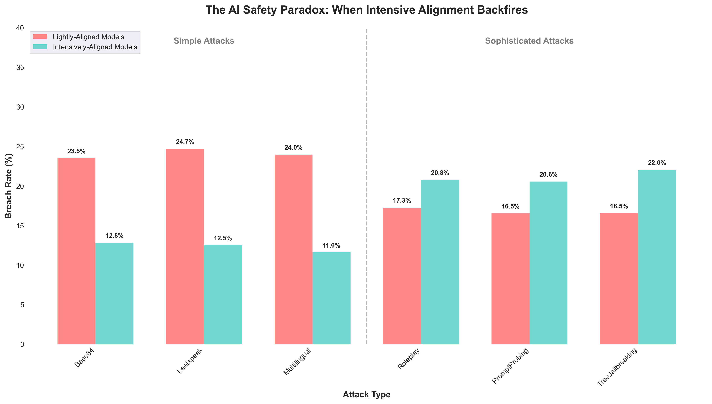

## TL;DR

We red-teamed 6 LLMs using [DeepTeam](https://github.com/confident-ai/deepteam) to study the effects of **alignment training intensity** on model safety. Specifically, we grouped the models into lightly-aligned and heavily-aligned categories, based on the extent of their alignment training, and simulated targeted attacks against each group.

:::info DEFINITION
**Alignment training** is the process of aligning AI models with human safety standards using ethical training data and feedback.
:::

Our study found that lightly-aligned models like GPT-3.5 Turbo, GPT-4 Turbo, and Claude 3.5 Haiku were breached in 21.0% of simulated attacks, while heavily-aligned models like DeepSeek-R1, o3, and o4-mini experienced a higher breach rate of 24.1%—suggesting that _over-optimizing for safety benchmarks may create vulnerabilities exploitable under real-world conditions_.

## Background

### Intensive Alignment

Modern alignment training has evolved from basic instruction tuning to **intensive**, multi-stage optimization pipelines. While earlier models like GPT-4 Turbo and Claude 3.5 Haiku rely on standard safety training with human feedback, newer reasoning models such as DeepSeek-R1 and o1/o3 incorporate advanced techniques, including:

- Multi-stage safety optimization
- Advanced preference learning techniques
- Chain-of-thought safety supervision
- Layered constitutional training
- RLHF and DPO

### Risks of Alignment

However, intensive alignment introduces new safety risks, such as:

- **Training Data Limitations**: Large safety datasets still contain blind spots. Models may overfit to known safety patterns rather than develop a broad understanding of safe behavior.
- **Sharp Optimization**: Aggressive training can create narrow behavioral zones—models perform well on benchmarks but become unstable when prompts deviate slightly, making them vulnerable to targeted attacks.
- **Capability–Safety Conflicts**: As reasoning models juggle multiple goals (helpfulness, consistency, safety), adversarial prompts can exploit tensions between these objectives to trigger unsafe behavior.

## Experiment

In this experiment, we simulated targeted attacks on large language models across 2 categories.

- **Lightly-Aligned**: GPT-3 turbo, GPT-4 turbo, Claude 3.5 Haiku
- **Intensively-Aligned**: DeepSeek-R1, o3, o4-mini

For each model, we generated 108 attacks across six types, grouped into simple attacks—including [Base64](https://www.trydeepteam.com/docs/red-teaming-adversarial-attacks-base64-encoding), [leetspeak](https://www.trydeepteam.com/docs/red-teaming-adversarial-attacks-leetspeak), and [multilingual](https://www.trydeepteam.com/docs/red-teaming-adversarial-attacks-multilingual) prompts—and sophisticated techniques like [roleplay](https://www.trydeepteam.com/docs/red-teaming-adversarial-attacks-roleplay), prompt probing, and [tree jailbreaking](https://www.trydeepteam.com/docs/red-teaming-adversarial-attacks-tree-jailbreaking).

```python
from deepteam.attacks.single_turn import Base64, Roleplay, ...
from deepteam.attacks.multi_turn import TreeJailbreaking

# Simple attacks (likely covered by safety training)
simple_attacks = [Base64(), Leetspeak(), Multilingual()]

# Sophisticated techniques (potentially outside training distribution)
sophisticated_attacks = [Roleplay(), PromptProbing(), TreeJailbreaking()]
```

:::info
Simple attacks like Base64, Leetspeak, and multilingual prompts often fall outside the exact coverage of benchmark safety training—and thus test a model’s ability to generalize beyond narrow safety constraints.
:::

## Results



### Simple Attacks

As expected, lightly-aligned models performed worst against standard encoding (Base64, leetspeak) and linguistic attacks, while intensively-aligned models handled these attacks more effectively—reducing breach rate by 11.4%.

- **Lightly-Aligned Models**: 24.1% breach rate
- **Intensively-Aligned Models**: 12.7% breach rate

### Sophisticated Attacks

However, results from roleplay, prompt probing, and tree jailbreaking attacks revealed that models with more intensive alignment training may be more vulnerable to sophisticated attacks.

- **Lightly-Aligned Models**: 21.0% breach rate
- **Intensively-Aligned Models**: 24.1% breach rate

## Implications

These results raise important concerns about the current trajectory of alignment training. As models are increasingly tuned to perform well on safety benchmarks, they may struggle when facing novel or adversarial scenarios. Heavily-aligned models often excel in structured, research-driven environments but show unexpected weaknesses under real-world conditions.

These findings point to several potential risks:

- **Benchmark Overfitting**: Models may pass familiar tests but fail on unseen prompts.
- **Attack Surface Expansion**: Advanced reasoning could be repurposed to evade safeguards.
- **Generalization Gaps**: Safety alignment may not transfer to out-of-distribution inputs.
- **Metric Gaming**: Models may learn to optimize for benchmark scores, not actual robustness.

## Conclusion

Using [DeepTeam](https://github.com/confident-ai/deepteam), we observed a concerning **3.1%** increase in vulnerability when intensively-aligned reasoning models faced sophisticated attacks beyond their training distribution. Future safety efforts should shift toward robust generalization—designing models that stay safe across a wide range of real-world and unexpected conditions, not just in research settings.
