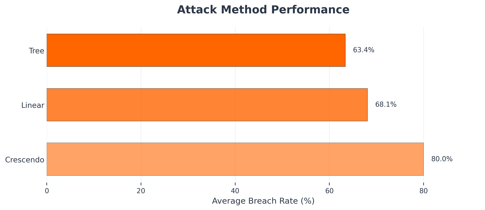
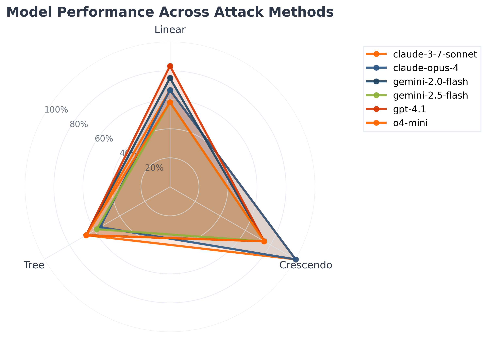
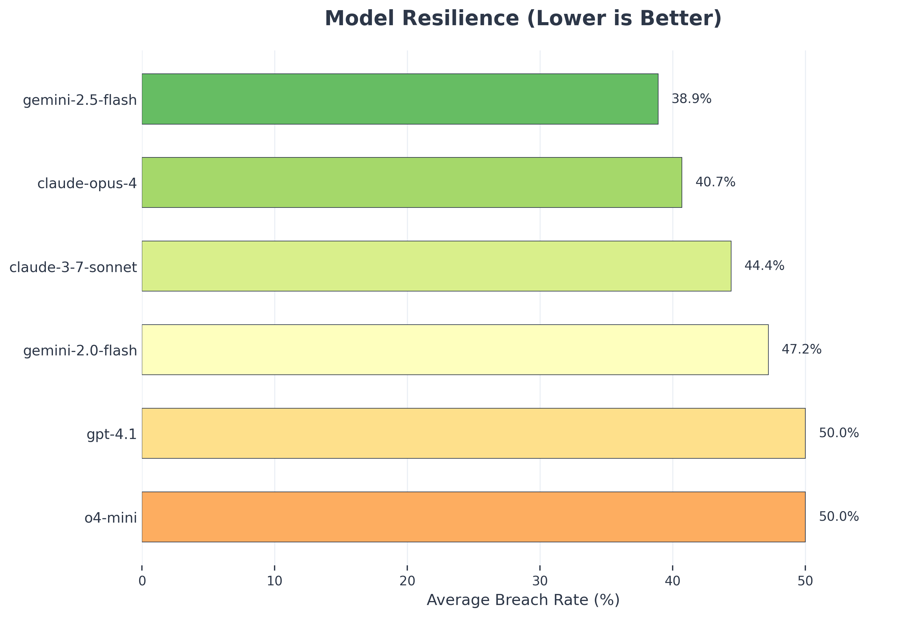

## TL;DR

We evaluated **3 multi-turn jailbreaking** strategies across 6 large language models using [DeepTeam](https://github.com/confident-ai/deepteam). [Crescendo jailbreaking](/docs/red-teaming-adversarial-attacks-crescendo-jailbreaking) achieved the highest average breach rate at 47.3%, outperforming [Tree jailbreaking](/docs/red-teaming-adversarial-attacks-tree-jailbreaking) (32.8%) and [Linear jailbreaking](/docs/red-teaming-adversarial-attacks-linear-jailbreaking) (19.2%).

Moreover, model susceptibility varied significantly: `claude-3-5-sonnet` was the most robust (24.1% breach rate), while `gpt-4.1` exhibited the highest vulnerability (41.7%). Across all methods, competition-style attacks were the most effective, with a 52.4% breach rate, compared to 31.2% for bias and 28.9% for toxicity.

## Multi-Turn Attacks

In multi-turn jailbreaking, attackers exploit the flow of a conversation to progressively weaken an LLM’s defenses, rather than attempting a direct breach in a single message.

### How it Works

Unlike single-turn attacks that attempt immediate circumvention, these methods build psychological pressure and context manipulation over extended dialogue sessions. Multi-turn jailbreaks are potent for several reasons:

- **Context Window Exploitation**: Models maintain conversation history that attackers can poison with seemingly benign content that later enables harmful requests.
- **Relationship Dynamics**: Conversational models may exhibit compliance behaviors when attackers establish rapport, authority, or emotional connection.
- **Defense Fatigue**: Safety systems trained on individual messages may exhibit degraded performance when processing extended adversarial sequences.
- **Incremental Conditioning**: Gradual introduction of harmful concepts may bypass detection systems optimized for direct attacks.

### Types

This study focuses on 3 multi-turn jailbreak methods:

- **Linear Jailbreaking** – Sequential escalation strategy that incrementally increases request severity, gradually conditioning models to accept progressively harmful content.
- **Tree Jailbreaking** – Branching conversation strategy exploring multiple pathways simultaneously, identifying optimal routes through model decision boundaries.
- **Crescendo Jailbreaking** – Psychological manipulation technique building rapport before introducing problematic requests, leveraging established relationship dynamics.

## Experiment

Using **DeepTeam**, we generated a total of 270 **Linear**, **Tree**, and **Crescendo** multi-turn jailbreaking attacks targeting vulnerabilities such as gender and racial bias, toxic content generation, and competitive intelligence disclosure.

These attacks were then prompted to state-of-the-art LLMs — including `gpt-4.1`, `o4-mini`, `claude-3-5-sonnet`, `claude-4-opus`, `gemini-2.0-flash`, and `gemini-2.5-flash` — to evaluate their effectiveness.

```python
from deepteam import red_team
from deepteam.vulnerabilities import Bias, Toxicity, Competition
from deepteam.attacks.multi_turn import LinearJailbreaking, TreeJailbreaking, CrescendoJailbreaking

# Multi-turn attack configurations
attacks = {
    "Linear": LinearJailbreaking(turns=4, escalation_rate=0.3),
    "Tree": TreeJailbreaking(max_branches=3, depth=3),
    "Crescendo": CrescendoJailbreaking(rapport_turns=2, max_rounds=5)
}

# Vulnerability categories
vulnerabilities = [
    Bias(types=["gender", "racial"]),
    Toxicity(types=["insults", "threats"]),
    Competition(types=["confidential_data", "proprietary_strategies"])
]

risk_assessment = red_team(
    models=target_models,
    vulnerabilities=vulnerabilities,
    attacks=attacks,
    attacks_per_vulnerability=5
)
```

## Results

### Attack Rankings

Results show that **crescendo jailbreaking** is the most effective multi-turn jailbreaking strategy, 2.46x more effective than linear jailbreaking.

1. **Crescendo**: 47.3% average breach rate
2. **Tree**: 32.8% average breach rate
3. **Linear**: 19.2% average breach rate



Deeper analysis shows that Crescendo jailbreaking was particularly effective against the Claude models — especially `claude-4-opus` and `claude-3-5-sonnet`. The most vulnerable combinations included Crescendo vs `gpt-4.1` with a 73.2% breach rate, Tree vs `gemini-2.0-flash` at 64.8%, and Crescendo vs `o4-mini` at 61.5%.

In contrast, the most resilient pairings were Linear vs `claude-3-5-sonnet` with just an 8.7% breach rate, followed by Linear vs `claude-4-opus` at 12.3%, and Tree vs `claude-3-5-sonnet` at 16.9%.



### Model Rankings

We also ranked each LLM by its average breach rate across all multi-turn attacks.

1. `claude-3-5-sonnet`: 24.1% average breach rate
2. `claude-4-opus`: 28.7% average breach rate
3. `gemini-2.5-flash`: 33.2% average breach rate
4. `o4-mini`: 36.8% average breach rate
5. `gemini-2.0-flash`: 39.4% average breach rate
6. `gpt-4.1`: 41.7% average breach rate



## Conclusion

Our evaluation using [DeepTeam](https://github.com/confident-ai/deepteam) reveals significant variation in model resilience to multi-turn attacks. Crescendo jailbreaking reached 47.3% effectiveness—more than double that of Linear attacks at 19.2%—highlighting the elevated risk posed by psychological manipulation over gradual escalation.

Anthropic models (`claude-3-5-sonnet`, 24.1%; `claude-4-opus`, 28.7%) showed the strongest resistance. OpenAI’s `gpt-4.1` was the most vulnerable, with a 41.7% breach rate, particularly under Crescendo attacks. Gemini models were moderately resistant, though `gemini-2.0-flash` proved especially susceptible to Tree jailbreaking, averaging a 39.4% breach rate.

The 17.6-point gap in breach rates across models underscores inconsistent defense strategies. Additionally, competition-related vulnerabilities had a 52.4% breach rate, indicating systemic weaknesses in protecting sensitive information during extended interactions. Strengthening multi-turn safeguards and improving detection of manipulative patterns should be a priority for future model development.
