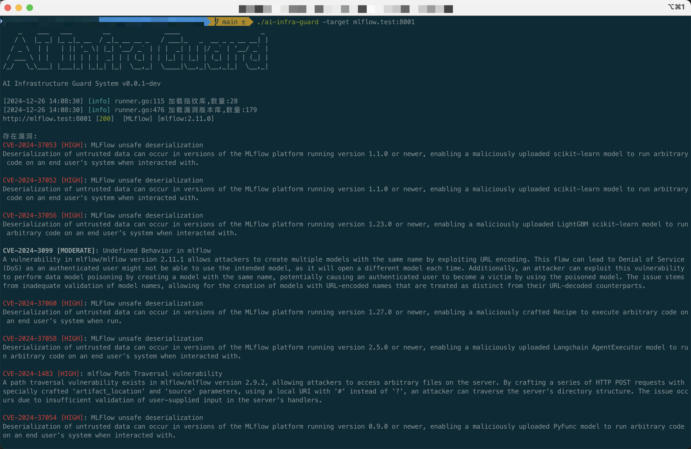

# 🛡️ AI Infrastructure Security Assessment System

[中文版](./README_CN.md)

AI Infra Guard is an **efficient**, **lightweight**, and **user-friendly** AI infrastructure security assessment tool designed to discover and detect potential security risks in AI systems.

## 🚀 Project Highlights
* **Efficient Scanning*** Supports 28 AI framework fingerprint identifications
    * Covers 200+ security vulnerability databases

* **Easy to Use**
    * Ready to use out of the box, no complex configuration
    * Fingerprint and vulnerability YAML rule definitions
    * Flexible matching syntax

* **Lightweight**
    * Clean and efficient core components
    * Small binary size, low resource usage
    * Cross-platform support

## 📊 AI Component Coverage
| Component Name      | Vulnerability Count |
|---------------------|----------|
|         anythingllm |        8 |
|           langchain |       33 |
|          Chuanhugpt |        0 |
|          clickhouse |       22 |
|           comfy_mtb |        1 |
| ComfyUI-Prompt-Preview |        1 |
| ComfyUI-Custom-Scripts |        1 |
|             comfyui |        1 |
|                dify |        0 |
|      fastchat-webui |        0 |
|            fastchat |        1 |
|               feast |        0 |
|              gradio |       42 |
|          jupyterlab |        6 |
|    jupyter-notebook |        1 |
|      jupyter-server |       13 |
|            kubeflow |        4 |
|              kubepi |        5 |
|        llamafactory |        1 |
|              ollama |        7 |
|          open-webui |        7 |
|           pyload-ng |       18 |
|           qanything |        2 |
|             ragflow |        2 |
|                 ray |        3 |
|         tensorboard |        0 |
|                vllm |        3 |
|          xinference |        0 |


## 🚀 Quick Preview
**Quick Usage**



**AI Analysis**


## 📦 Installation and Usage
### Installation
Download from: [https://github.com/Tencent/AI-Infra-Guard/releases](https://github.com/Tencent/AI-Infra-Guard/releases)

### Usage
**Single Target**
```
./ai-infra-guard -target [IP/Domain] 
```

**Multiple Targets**
```
./ai-infra-guard -target [IP/Domain] -target [IP/Domain]
```

**Read from File**
```
./ai-infra-guard -file target.txt
```

**AI Analysis**
```
./ai-infra-guard -target [IP/Domain] -ai -token [Hunyuan token]
```

## 🔍 Fingerprint Matching Rules
AI Infra Guard is based on WEB fingerprint identification components. Fingerprint rules are in the [data/fingerprints](./data/fingerprints) directory, and vulnerability matching rules are in the [data/vuln](./data/vuln) directory.

### Example: Gradio Fingerprint Rule
```yaml
info:
  name: gradio
  author: Security Team
  severity: info
  metadata:
    product: gradio
    vendor: gradio
http:
  - method: GET
    path: '/'
    matchers:
      - body="<script>window.gradio_config = {" || body="document.getElementsByTagName(\"gradio-app\");"
```

### 🛠️ Fingerprint Matching Syntax

#### Matching Locations
- Title
- Body
- Header
- Icon hash

#### Logical Operators
- `=` Fuzzy match
- `==` Exact match
- `!=` Not equal
- `~=` Regular expression match
- `&&` AND
- `||` OR
- `()` Grouping

## 🤝 Contributing
Community contributions are highly welcome! Feel free to submit [PRs](https://github.com/Tencent/AI-Infra-Guard/pulls) and [Issues](https://github.com/Tencent/AI-Infra-Guard/issues).

## 📄 License
"AI Infra Guard" is licensed under the MIT License except for the third-party components. Visit [License.txt](./License.txt)

---

💡 **Tip**: Stay updated to protect your AI infrastructure security!