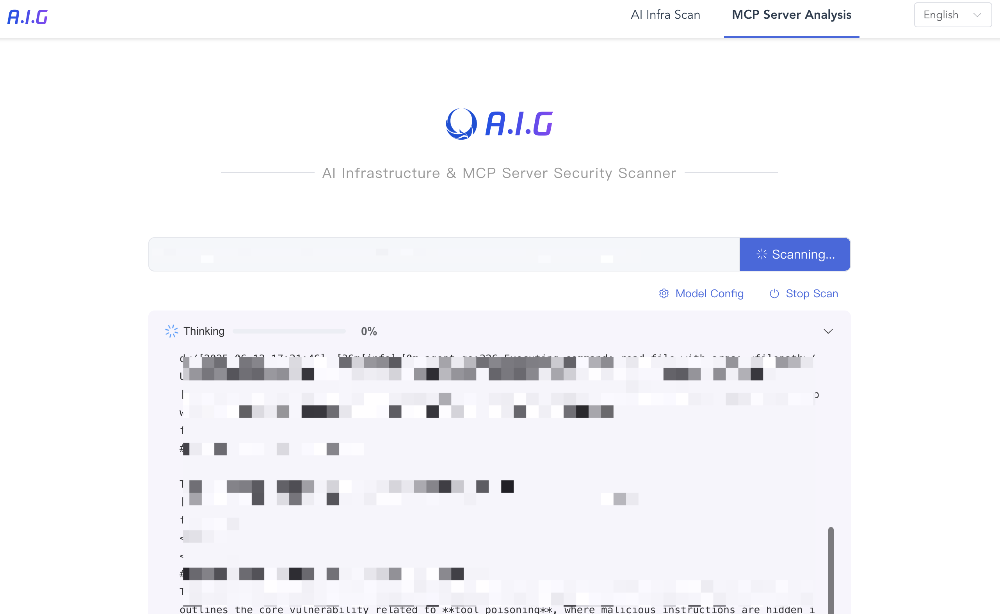
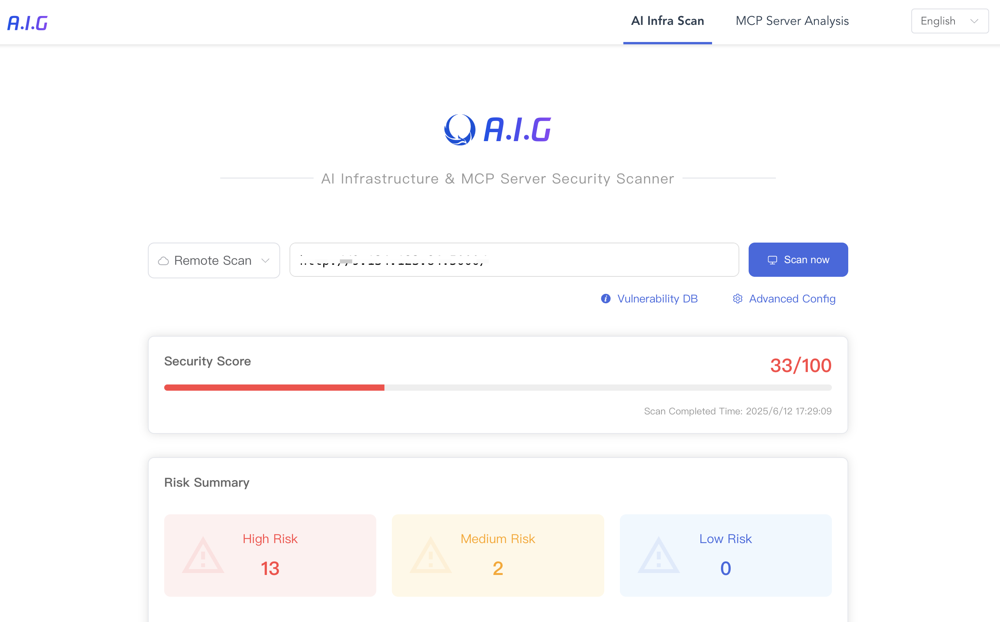

# 🛡️ A.I.G（AI-Infra-Guard）
[中文版](./README_CN.md)  

A comprehensive, intelligent, easy-to-use, and lightweight AI Infrastructure Vulnerability Assessment and MCP Server Security Analysis Tool, developed by Tencent Zhuque Lab.

**工具反馈问卷**
> A.I.G（AI-Infra-Guard）年初发布至今一直保持快速迭代中，为了打造更全面、智能、易用的全新的AI安全红队平台并吸引更多用户共建，在此特别邀请您参与一个5分钟的用户需求调研，对于有价值的反馈将我们后续会安排寄送腾讯特色小礼品，感谢大家的关注与支持。

https://doc.weixin.qq.com/forms/AJEAIQdfAAoAbUAxgbhAIQCNfZu1TQeRf

## Table of Contents

- [🚀 Quick Preview](#-quick-preview)
- [✨ Project Highlights](#-project-highlights)
- [📋 Feature Description](#-feature-description)
- [🤝 MCP Security Certification and Cooperation](#mcp-security-certification-and-cooperation)
- [📦 Installation and Usage](#-installation-and-usage)
  - [Installation](#installation)
  - [Command Line Structure](#command-line-structure)
  - [Usage](#usage)
    - [WebUI Visual Operation](#webui-visual-operation)
    - [Security Vulnerability Scanning (scan)](#security-vulnerability-scanning-scan)
    - [MCP Server Scanning (mcp)](#mcp-server-scanning-mcp)
- [📊 Covered MCP Security Risks](#-covered-mcp-security-risks)
- [📊 Covered AI Component Vulnerabilities](#-covered-ai-component-vulnerabilities)
- [🔍 Component Fingerprinting Rules](#-component-fingerprinting-rules)
  - [Example: Gradio Fingerprint Rule](#example-gradio-fingerprint-rule)
  - [Fingerprint Matching Syntax](#fingerprint-matching-syntax)
- [🤝 Contribution](#-contribution)
- [📄 License](#-license)

## 🚀 Quick Preview

**MCP Server Code/Online Service Analysis**
<br>

<br>

**Infrastructure Vulnerability Scanning**
<br>

<br>

## ✨ Project Highlights

*   **Comprehensive Security Assessment Capabilities**
  *   Supports analysis of 9 common MCP security risks, continuously updated.
  *   Supports identification of 28 AI component frameworks, covering 200+ vulnerability fingerprints.
  *   Supports private deployment for easy integration into internal security scanning pipelines.
*   **Intelligent and User-Friendly Experience**
  *   MCP security analysis driven by AI Agent for one-click intelligent analysis.
  *   AI component vulnerability scanning supports custom fingerprints and YAML vulnerability rules.
  *   Out-of-the-box usability with no complex configuration required, providing a Web interface for visual operation.
*   **Lightweight Design**
  *   Core components are concise and efficient.
  *   Small binary size and low resource consumption.
  *   Cross-platform support (Windows/MacOS/Linux).

## 🤝 MCP Security Certification and Cooperation
AI Infra Guard is committed to providing professional MCP security analysis and certification solutions. We welcome MCP marketplaces, developer platforms, and hosting providers to integrate our tool into their pre-listing security scanning process for MCP Servers and display the scan results in the MCP marketplace, collectively building a safer MCP ecosystem.

If you are interested in cooperating with us, please contact Tencent Zhuque Lab at zhuque [at] tencent.com.

We also welcome you to share your implementation cases within the MCP community.

## 📋 Feature Description

AI Infra Guard consists of three core modules:

1.  **AI Component Vulnerability Scanning (`scan`)**: Detects known security vulnerabilities in web-based components within AI infrastructure.
2.  **MCP Security Analysis (`mcp`)**: Analyzes security risks in MCP Server code based on AI Agent.
3.  **WebUI Mode (`webserver`)**: Enables the web-based visual operation interface.

## 📦 Installation and Usage

### Installation

Download the latest version suitable for your operating system from the [Releases](https://github.com/Tencent/AI-Infra-Guard/releases) page.

### Command Line Structure

AI Infra Guard uses a subcommand structure:

```bash
./ai-infra-guard <subcommand> [options]
```

Main subcommands:

*   `scan`: Executes AI component security vulnerability scanning.
*   `mcp`: Executes MCP Server code security analysis.
*   `webserver`: Starts the Web interface server.

### Usage

#### WebUI Visual Operation

Start the web server, listening on `127.0.0.1:8088` by default:

```bash
./ai-infra-guard webserver
```

Specify the listening address and port:

```bash
./ai-infra-guard webserver --ws-addr <IP>:<PORT>
```
*Example: `./ai-infra-guard webserver --ws-addr 0.0.0.0:9090`*

#### AI Component Vulnerability Scanning (`scan`)

**Local One-Click Detection** (Scans common local service ports):

```bash
./ai-infra-guard scan --localscan
```

**Scan a Single Target**:

```bash
./ai-infra-guard scan --target <IP/Domain>
```
*Example: `./ai-infra-guard scan --target example.com`*

**Scan Multiple Targets**:

```bash
./ai-infra-guard scan --target <IP/Domain1> --target <IP/Domain2>
```
*Example: `./ai-infra-guard scan --target 192.168.1.1 --target example.org`*

**Read Targets from a File**:

```bash
./ai-infra-guard scan --file target.txt
```
*The `target.txt` file should contain one target URL or IP address per line.*

**View Full Parameters for the `scan` Subcommand**:

```bash
./ai-infra-guard scan --help
```

**`scan` Subcommand Parameter Description**:

```
Usage:
  ai-infra-guard scan [flags]

Flags:
      --ai                      Enable AI analysis (requires LLM Token configuration)
      --check-vul               Validate the effectiveness of vulnerability templates
      --deepseek-token string   DeepSeek API token (for --ai feature)
  -f, --file string             File path containing target URLs
      --fps string              Fingerprint template file or directory (default: "data/fingerprints")
      --header stringArray      Custom HTTP request headers (can be specified multiple times, format: "Key:Value")
  -h, --help                    Show help information
      --hunyuan-token string    Hunyuan API token (for --ai feature)
      --lang string             Response language (zh/en, default: "zh")
      --limit int               Maximum requests per second (default: 200)
      --list-vul                List all available vulnerability templates
      --localscan               Perform local one-click scan
  -o, --output string           Result output file path (supports .txt, .json, .csv formats)
      --proxy-url string        HTTP/SOCKS5 proxy server URL
  -t, --target stringArray      Target URL (can be specified multiple times)
      --timeout int             HTTP request timeout in seconds (default: 5)
      --vul string              Vulnerability database directory (default: "data/vuln")
```

#### MCP Server Security Risk Analysis (`mcp`)

This feature automatically analyzes security issues in MCP Server code using an AI Agent.

**Basic Usage** (Uses OpenAI API by default, requires Token):

```bash
./ai-infra-guard mcp --code <source_code_path> --model <model_name> --token <api_token> [--base-url <api_base_url>]
```
*Example: `./ai-infra-guard mcp --code /path/to/mcp/server --model gpt-4 --token sk-xxxxxx`*

**Specify Output Format**:

```bash
./ai-infra-guard mcp --code <source_code_path> --model <model_name> --token <api_token> --csv results.csv --json results.json
```

**View Full Parameters for the `mcp` Subcommand**:

```bash
./ai-infra-guard mcp --help
```

**`mcp` Subcommand Parameter Description**:

```
Usage:
  ai-infra-guard mcp [flags]

Flags:
      --base-url string   LLM API base URL (optional, overrides default OpenAI URL)
      --code string       Path to the MCP Server source code to scan (required)
      --csv string        Output results to a CSV file path
  -h, --help              Show help information
      --json string       Output results to a JSON file path
      --log string        Log file save path
      --model string      AI model name (required, e.g., gpt-4, gpt-3.5-turbo)
      --plugins string    Specify enabled plugins list (comma-separated, optional)
      --token string      LLM API token (required)
```

## 📊 Covered MCP Security Risks

AI Infra Guard can analyze the following common MCP security risks, with continuous updates:

| Risk Name                   | Risk Description                                                                                                                                                                                                                            |
|-----------------------------|---------------------------------------------------------------------------------------------------------------------------------------------------------------------------------------------------------------------------------------------|
| Tool Poisoning Attack       | Malicious MCP Server injects hidden instructions via tool descriptions to manipulate the AI Agent into performing unauthorized actions (e.g., data exfiltration, executing malicious code or commands).                                                    |
| Rug Pull                | Malicious MCP Server behaves normally initially but changes behavior after user approval or several runs to execute malicious instructions, leading to difficult-to-detect malicious activities.                                                    |
| Tool Shadowing Attack      | Malicious MCP Server uses hidden instructions to redefine the behavior of other trusted MCP Server tools (e.g., modifying email recipients, executing unauthorized operations).                                                               |
| Malicious Code/Command Execution | If an MCP Server supports direct code or command execution without proper sandboxing, attackers could exploit it to execute malicious operations on the server or user's local machine.                                                        |
| Data Exfiltration           | Malicious MCP Server induces the AI Agent to exfiltrate sensitive data (e.g., API keys, SSH keys) or directly transmits user-authorized input data to external servers.                                                                     |
| Unauthorized Access/Authentication | MCP Server lacks effective authorization/authentication mechanisms or has flaws, allowing attackers to bypass verification and access restricted resources or user data.                                                                               |
| Indirect Prompt Injection   | MCP Server outputs external data containing malicious instructions (e.g., web pages, documents) to the AI Agent, potentially compromising the AI Agent's integrity and leading to unintended actions.                                                               |
| Package Name Squatting      | Malicious MCP Server uses names, tool names, or descriptions similar to trusted services to trick the AI Agent into invoking malicious services; or a third party squats on an official MCP Server name to distribute malware or implant backdoors. |
| Insecure Storage of Sensitive Keys | MCP Server hardcodes or stores sensitive keys in plaintext within code or configuration files, leading to potential key leakage risks.                                                                                                          |

## 📊 Covered AI Component Vulnerabilities

AI Infra Guard supports detection of known vulnerabilities in various AI-related components:

| Component Name           | Vulnerability Count |
|--------------------------|---------------------|
| anythingllm              | 8                   |
| langchain                | 33                  |
| Chuanhugpt               | 0                   |
| clickhouse               | 22                  |
| comfy_mtb                | 1                   |
| ComfyUI-Prompt-Preview   | 1                   |
| ComfyUI-Custom-Scripts   | 1                   |
| comfyui                  | 1                   |
| dify                     | 11                  |
| fastchat-webui           | 0                   |
| fastchat                 | 1                   |
| feast                    | 0                   |
| gradio                   | 42                  |
| jupyterlab               | 6                   |
| jupyter-notebook         | 1                   |
| jupyter-server           | 13                  |
| kubeflow                 | 4                   |
| kubepi                   | 5                   |
| llamafactory             | 1                   |
| llmstudio                | 0                   |
| ollama                   | 7                   |
| open-webui               | 8                   |
| pyload-ng                | 18                  |
| qanything                | 2                   |
| ragflow                  | 2                   |
| ray                      | 4                   |
| tensorboard              | 0                   |
| vllm                     | 4                   |
| xinference               | 0                   |
| triton-inference-server  | 7                   |
| **Total**                | **200+**            |

*Note: The vulnerability database is continuously updated.*

## 🔍 Component Fingerprinting Rules

AI Infra Guard uses YAML-based rules for web component fingerprinting and vulnerability matching.

*   **Fingerprint Rules**: Stored in the `data/fingerprints` directory.
*   **Vulnerability Rules**: Stored in the `data/vuln` directory.

### Example: Gradio Fingerprint Rule (`data/fingerprints/gradio.yaml`)

```yaml
info:
  name: gradio
  author: Security Team
  severity: info
  metadata:
    product: gradio
    vendor: gradio
http:
  - method: GET
    path: '/'
    matchers:
      # Match if the response body contains Gradio-specific JavaScript configuration or elements
      - body="<script>window.gradio_config = {" || body="document.getElementsByTagName(\"gradio-app\");"
```

### Fingerprint Matching Syntax

#### Match Locations

*   `title`: HTML page title
*   `body`: HTTP response body
*   `header`: HTTP response header
*   `icon`: Hash value (e.g., MurmurHash3) of the website's favicon

#### Logical Operators

*   `=`: Fuzzy contains match (case-insensitive)
*   `==`: Exact equals match (case-sensitive)
*   `!=`: Not equals match
*   `~=`: Regular expression match
*   `&&`: Logical AND
*   `||`: Logical OR
*   `()`: Used for grouping to change operator precedence

## 🤝 Contribution

We welcome community contributions!

*   **Report Issues**: [Submit an Issue](https://github.com/Tencent/AI-Infra-Guard/issues)
*   **Submit Code**: [Create a Pull Request](https://github.com/Tencent/AI-Infra-Guard/pulls)
## Wechat Group


## 📄 License

This project is open-sourced under the **MIT License**. For details, please refer to the [License.txt](./License.txt) file.

---
[](https://star-history.com/#Tencent/AI-Infra-Guard&Date)
