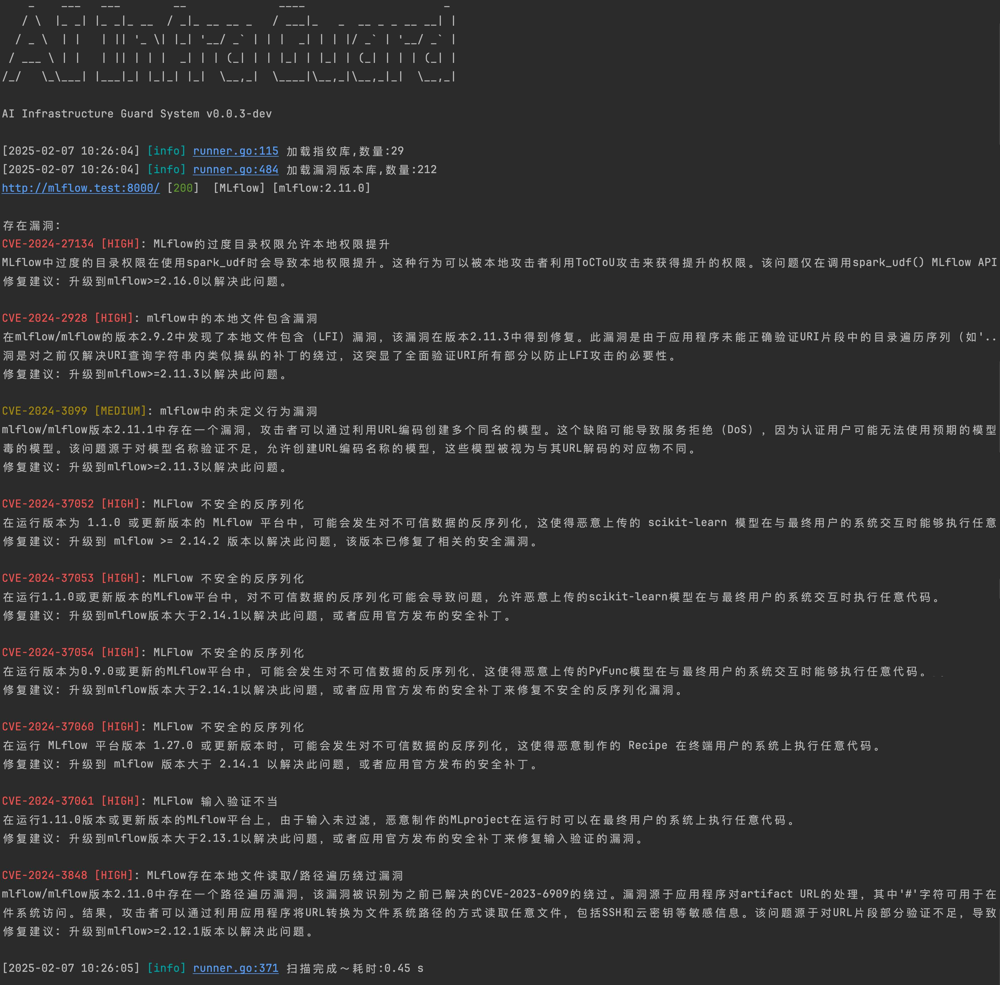
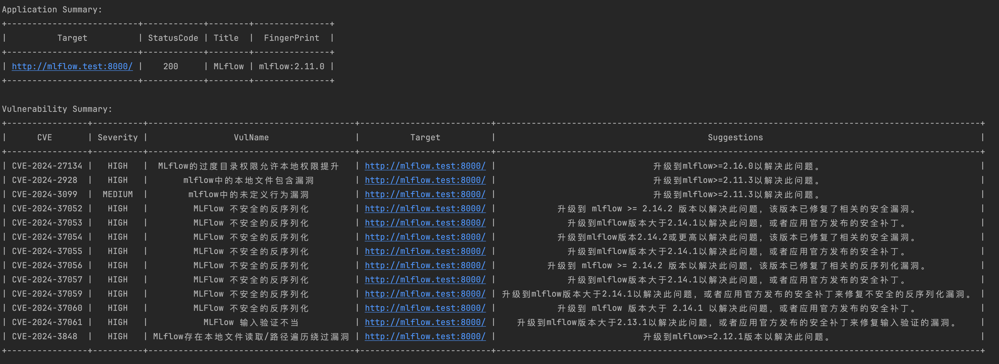
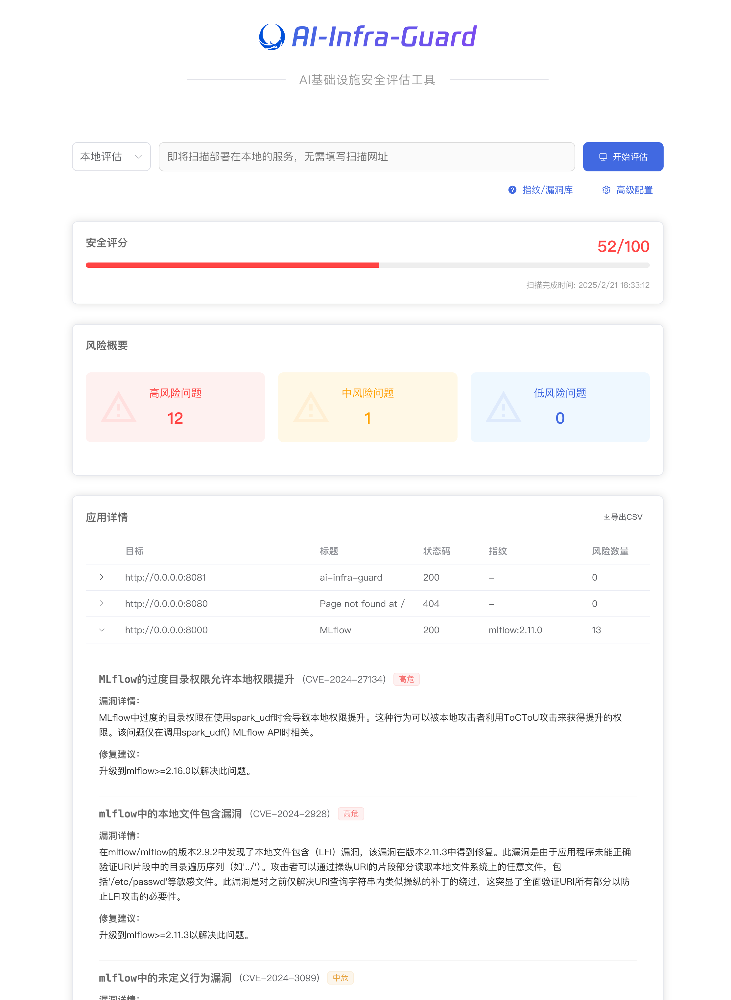

# 🛡️ AI基础设施安全评估系统
AI Infra Guard(AI Infrastructure Guard) 是一个**高效**、**轻量**、**易用**的AI基础设施安全评估工具，专为发现和检测AI系统潜在安全风险而设计。

## 🚀 项目亮点
* **高效扫描**
    * 支持 28 种 AI 框架指纹识别
    * 涵盖 200+ 安全漏洞数据库

* **易于使用**
    * 开箱即用，无复杂配置
    * 指纹、漏洞YAML规则定义
    * 灵活的匹配语法

* **轻量级**
    * 核心组件简洁高效
    * 二进制体积小，资源占用低
    * 跨平台支持

## 📊 AI组件覆盖情况
| 组件名称            | 漏洞数量 |
|---------------------|----------|
|         anythingllm |        8 |
|           langchain |       33 |
|          Chuanhugpt |        0 |
|          clickhouse |       22 |
|           comfy_mtb |        1 |
| ComfyUI-Prompt-Preview |        1 |
| ComfyUI-Custom-Scripts |        1 |
|             comfyui |        1 |
|                dify |        0 |
|      fastchat-webui |        0 |
|            fastchat |        1 |
|               feast |        0 |
|              gradio |       42 |
|          jupyterlab |        6 |
|    jupyter-notebook |        1 |
|      jupyter-server |       13 |
|            kubeflow |        4 |
|              kubepi |        5 |
|        llamafactory |        1 |
|           llmstudio |        0 |
|              ollama |        7 |
|          open-webui |        8 |
|           pyload-ng |       18 |
|           qanything |        2 |
|             ragflow |        2 |
|                 ray |        4 |
|         tensorboard |        0 |
|                vllm |        4 |
|          xinference |        0 |


## 🚀 快速预览
**快速使用**




**WEBUI**


## 📦 安装与使用
### 安装
下载地址: [https://github.com/Tencent/AI-Infra-Guard/releases](https://github.com/Tencent/AI-Infra-Guard/releases)

### 使用
**WEBUI 可视化操作**
```
./ai-infra-guard -ws
```
**本地一键检测**
```
./ai-infra-guard -localscan
```

**单个目标**
```
./ai-infra-guard -target [IP/域名] 
```

**多个目标**
```
./ai-infra-guard -target [IP/域名] -target [IP/域名]
```

**从文件读取**
```
./ai-infra-guard -file target.txt
```

**AI分析**
```
./ai-infra-guard -target [IP/域名] -ai -token [混元token]
```

## 🔍 指纹匹配规则
AI Infra Guard 基于WEB指纹识别组件，指纹规则在[data/fingerprints](./data/fingerprints)目录中，漏洞匹配规则在[data/vuln](./data/vuln)目录中。
### 示例：Gradio 指纹规则

```yaml
info:
  name: gradio
  author: Security Team
  severity: info
  metadata:
    product: gradio
    vendor: gradio
http:
  - method: GET
    path: '/'
    matchers:
      - body="<script>window.gradio_config = {" || body="document.getElementsByTagName(\"gradio-app\");"
```

### 🛠️ 指纹匹配语法

#### 匹配位置
- 标题（title）
- 正文（body）
- 请求头（header）
- 图标哈希（icon）

#### 逻辑运算符
- `=` 模糊匹配
- `==` 全等
- `!=` 不等
- `~=` 正则匹配
- `&&` 与
- `||` 或
- `()` 括号分组

## 🤝 贡献

我们非常欢迎社区贡献！欢迎提交 [PR](https://github.com/Tencent/AI-Infra-Guard/pulls) 和 [Issue](https://github.com/Tencent/AI-Infra-Guard/issues)。
## Star History

[](https://star-history.com/#Tencent/AI-Infra-Guard&Date)

## 📄 许可证
"AI Infra Guard" is licensed under the MIT License except for the third-party components.Visited [License.txt](./License.txt)

---

💡 **提示**：持续关注更新，保护您的AI基础设施安全！