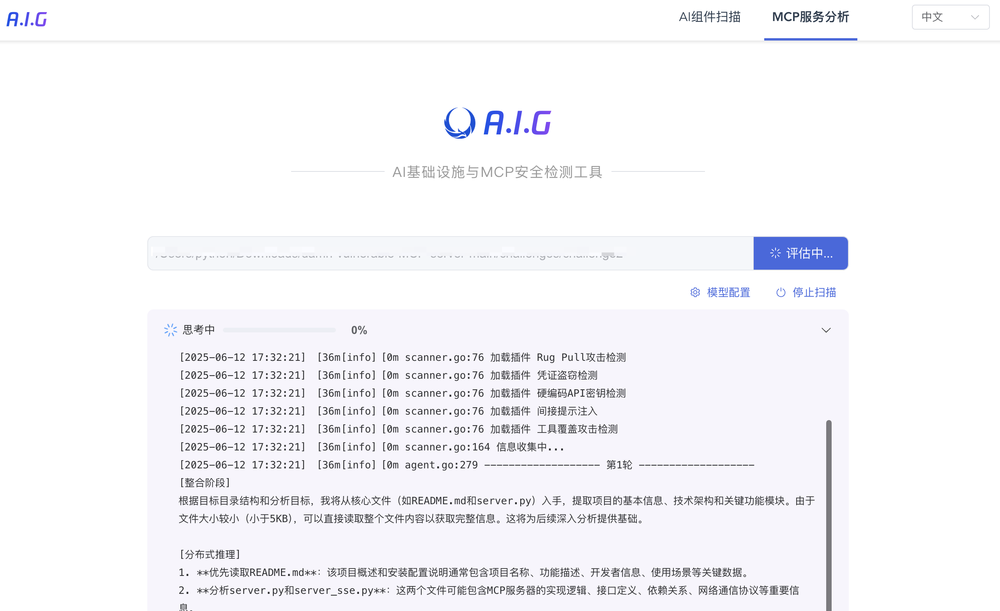
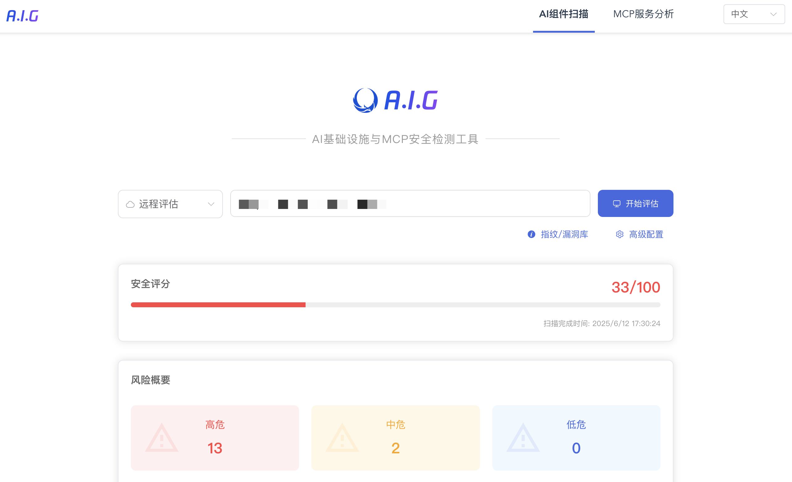

# 🛡️ A.I.G（AI-Infra-Guard）

腾讯朱雀实验室推出的一款全面、智能、易用且轻量化的AI基础设施漏洞发现与MCP Server安全风险扫描工具。

**工具反馈问卷**
> A.I.G（AI-Infra-Guard）年初发布至今一直保持快速迭代中，为了打造更全面、智能、易用的全新的AI安全红队平台并吸引更多用户共建，在此特别邀请您参与一个5分钟的用户需求调研，对于有价值的反馈将我们后续会安排寄送腾讯特色小礼品，感谢大家的关注与支持。

https://doc.weixin.qq.com/forms/AJEAIQdfAAoAbUAxgbhAIQCNfZu1TQeRf

## 目录

- [🚀 快速预览](#-快速预览)
- [✨ 项目亮点](#-项目亮点)
- [📋 功能说明](#-功能说明)
- [🤝 MCP安全认证与合作](#mcp安全认证与合作)
- [📦 安装与使用](#-安装与使用)
  - [安装](#安装)
  - [命令行结构](#命令行结构)
  - [使用方法](#使用方法)
    - [WebUI 可视化操作](#webui-可视化操作)
    - [安全漏洞扫描 (scan)](#安全漏洞扫描-scan)
    - [MCP Server扫描 (mcp)](#mcp-server扫描-mcp)
- [📊 MCP安全风险覆盖](#-mcp安全风险覆盖)
- [📊 AI组件漏洞覆盖](#-ai组件漏洞覆盖)
- [🔍 AI组件指纹匹配规则](#-ai组件指纹匹配规则)
  - [示例：Gradio 指纹规则](#示例gradio-指纹规则)
  - [指纹匹配语法](#指纹匹配语法)
- [🤝 贡献](#-贡献)
- [📄 许可证](#-许可证)

## 🚀 快速预览

**MCP Server代码/在线服务检测**
<br>

<br>

**基础设施检测**
<br>

<br>

## ✨ 项目亮点

*   **全面的安全检测能力**
  *   支持9类MCP常见安全风险检测，并持续更新。
  *   支持28种AI组件框架识别，涵盖200+漏洞指纹。
  *   支持私有化部署，方便集成到内部安全扫描流水线。
*   **智能易用的功能体验**
  *   MCP安全检测由AI Agent驱动，一键智能分析。
  *   AI组件漏洞扫描支持自定义指纹和漏洞YAML规则。
  *   开箱即用，无需复杂配置，提供Web界面可视化操作。
*   **轻量级设计**
  *   核心组件简洁高效。
  *   二进制体积小，资源占用低。
  *   跨平台支持（Windows/MacOS/Linux）。

## 🤝 MCP安全认证与合作
AI Infra Guard 致力于提供专业的MCP安全检测与安全认证解决方案。我们欢迎MCP市场、开发者平台与托管商将我们的工具集成到MCP Server上架前的安全扫描流程中，并在MCP市场中展示扫描结果，共同打造更安全的MCP生态。

如果您有兴趣与我们合作，欢迎通过 zhuque [at] tencent.com 联系腾讯朱雀实验室。

我们也欢迎您在MCP社区中分享您的实践落地案例。

## 📋 功能说明

AI Infra Guard 包含三大核心模块：

1.  **AI组件安全扫描 (`scan`)**: 检测AI基础设施中Web类组件的已知安全漏洞。
2.  **MCP安全检测 (`mcp`)**: 检测MCP Server代码或在线MCP Server服务的安全风险。
3.  **WebUI模式 (`webserver`)**: 启用Web可视化操作界面。

## 📦 安装与使用

### 安装

从 [Releases](https://github.com/Tencent/AI-Infra-Guard/releases) 页面下载适合您操作系统的最新版本。

### 命令行结构

AI Infra Guard 采用子命令结构：

```bash
./ai-infra-guard <子命令> [选项]
```

主要子命令：

*   `scan`: 执行AI组件安全漏洞扫描。
*   `mcp`: 执行MCP Server代码安全检测。
*   `webserver`: 启动Web界面服务器。

### 使用方法

#### WebUI 可视化操作

启动Web服务器，默认监听 `127.0.0.1:8088`：

```bash
./ai-infra-guard webserver
```

指定监听地址和端口：

```bash
./ai-infra-guard webserver --ws-addr <IP>:<PORT>
```
*例如: `./ai-infra-guard webserver --ws-addr 0.0.0.0:9090`*

#### AI组件安全漏洞扫描 (`scan`)

**本地一键检测** (扫描本地常见服务端口):

```bash
./ai-infra-guard scan --localscan
```

**扫描单个目标**:

```bash
./ai-infra-guard scan --target <IP/域名>
```
*例如: `./ai-infra-guard scan --target example.com`*

**扫描多个目标**:

```bash
./ai-infra-guard scan --target <IP/域名1> --target <IP/域名2>
```
*例如: `./ai-infra-guard scan --target 192.168.1.1 --target example.org`*

**从文件读取目标**:

```bash
./ai-infra-guard scan --file target.txt
```
*`target.txt` 文件每行包含一个目标URL或IP地址。*

**查看 `scan` 子命令完整参数**:

```bash
./ai-infra-guard scan --help
```

**`scan` 子命令参数说明**:

```
Usage:
  ai-infra-guard scan [flags]

Flags:
      --ai                      启用AI分析 (需要配置LLM Token)
      --check-vul               验证漏洞模板有效性
      --deepseek-token string   DeepSeek API令牌 (用于 --ai 功能)
  -f, --file string             包含目标URL的文件路径
      --fps string              指纹模板文件或目录 (默认: "data/fingerprints")
      --header stringArray      自定义HTTP请求头 (可多次指定, 格式: "Key:Value")
  -h, --help                    显示帮助信息
      --hunyuan-token string    混元API令牌 (用于 --ai 功能)
      --lang string             响应语言 (zh/en, 默认: "zh")
      --limit int               每秒最大请求数 (默认: 200)
      --list-vul                列出所有可用的漏洞模板
      --localscan               执行本地一键扫描
  -o, --output string           结果输出文件路径 (支持 .txt, .json, .csv 格式)
      --proxy-url string        HTTP/SOCKS5 代理服务器URL
  -t, --target stringArray      目标URL (可多次指定)
      --timeout int             HTTP请求超时时间(秒) (默认: 5)
      --vul string              漏洞数据库目录 (默认: "data/vuln")
```

#### MCP Server安全风险检测 (`mcp`)

此功能基于AI Agent自动检测MCP Server代码中的安全问题。

**基本使用** (默认使用 OpenAI API，需提供 Token):

```bash
./ai-infra-guard mcp --code <源代码路径> --model <模型名称> --token <API令牌> [--base-url <API基础URL>]
```
*例如: `./ai-infra-guard mcp --code /path/to/mcp/server --model gpt-4 --token sk-xxxxxx`*

**指定输出格式**:

```bash
./ai-infra-guard mcp --code <源代码路径> --model <模型名称> --token <API令牌> --csv results.csv --json results.json
```

**查看 `mcp` 子命令完整参数**:

```bash
./ai-infra-guard mcp --help
```

**`mcp` 子命令参数说明**:

```
Usage:
  ai-infra-guard mcp [flags]

Flags:
      --base-url string   LLM API基础URL (可选, 覆盖默认 OpenAI URL)
      --code string       待扫描的MCP Server源代码路径 (必需)
      --csv string        将结果输出为 CSV 文件路径
  -h, --help              显示帮助信息
      --json string       将结果输出为 JSON 文件路径
      --log string        日志文件保存路径
      --model string      AI模型名称 (必需, 例如: gpt-4, gpt-3.5-turbo)
      --plugins string    指定启用的插件列表 (英文逗号分隔, 可选)
      --token string      LLM API令牌 (必需)
```

## 📊 MCP安全风险覆盖

AI Infra Guard 可检测以下常见的MCP安全风险，并持续更新：

| 风险名称             | 风险说明                                                                                                                                                                                                 |
|----------------------|---------------------------------------------------------------------------------------------------------------------------------------------------------------------------------------------------------|
| 工具投毒攻击         | 恶意MCP Server通过工具描述注入隐藏指令，操纵AI Agent执行未授权操作（例如窃取数据、执行恶意行为）。                                                                                                           |
| 地毯式骗局           | 恶意MCP Server在初期表现正常，但在用户批准或运行若干次后改变行为，执行恶意指令，导致难以察觉的恶意行为。                                                                                                     |
| 工具覆盖攻击         | 恶意MCP Server通过隐藏指令重新定义其他可信MCP Server工具的行为（例如修改邮件接收者、执行额外操作）。                                                                                                         |
| 恶意代码/命令执行    | MCP Server若支持直接执行代码或命令且缺乏沙箱隔离，可能被攻击者利用在服务器或用户本地执行恶意操作。                                                                                                       |
| 数据窃取             | 恶意MCP Server诱导AI Agent读取并传输敏感数据（例如API密钥、SSH密钥），或直接将用户授权输入的数据发送至外部服务器。                                                                                             |
| 未授权访问/鉴权不当  | MCP Server缺乏有效授权认证或存在缺陷，导致攻击者可绕过验证访问受限资源或用户数据。                                                                                                                       |
| 间接提示词注入       | MCP Server将包含恶意指令的外部数据（例如网页、文档）输出给AI Agent，可能影响AI Agent的决策和行为。                                                                                                               |
| 包名混淆与抢注攻击   | 恶意MCP Server使用与可信服务相似的名称、工具名或描述，诱导AI Agent错误调用；或第三方抢注官方MCP Server名称，植入后门。                                                                                       |
| 明文存储密钥         | MCP Server在代码或配置文件中硬编码或明文存储敏感密钥，易导致泄露风险。                                                                                                                                 |

## 📊 AI组件漏洞覆盖

AI Infra Guard 支持检测多种AI相关组件的已知漏洞：

| 组件名称                 | 漏洞数量 |
|--------------------------|----------|
| anythingllm              | 8        |
| langchain                | 33       |
| Chuanhugpt               | 0        |
| clickhouse               | 22       |
| comfy_mtb                | 1        |
| ComfyUI-Prompt-Preview   | 1        |
| ComfyUI-Custom-Scripts   | 1        |
| comfyui                  | 1        |
| dify                     | 11       |
| fastchat-webui           | 0        |
| fastchat                 | 1        |
| feast                    | 0        |
| gradio                   | 42       |
| jupyterlab               | 6        |
| jupyter-notebook         | 1        |
| jupyter-server           | 13       |
| kubeflow                 | 4        |
| kubepi                   | 5        |
| llamafactory             | 1        |
| llmstudio                | 0        |
| ollama                   | 7        |
| open-webui               | 8        |
| pyload-ng                | 18       |
| qanything                | 2        |
| ragflow                  | 2        |
| ray                      | 4        |
| tensorboard              | 0        |
| vllm                     | 4        |
| xinference               | 0        |
| triton-inference-server  | 7        |
| **总计**                 | **200+** |

*注：漏洞库持续更新中。*

## 🔍 AI组件指纹匹配规则

AI Infra Guard 使用基于YAML的规则进行Web指纹识别和漏洞匹配。

*   **指纹规则**: 存储在 `data/fingerprints` 目录。
*   **漏洞规则**: 存储在 `data/vuln` 目录。

### 示例：Gradio 指纹规则 (`data/fingerprints/gradio.yaml`)

```yaml
info:
  name: gradio
  author: Security Team
  severity: info
  metadata:
    product: gradio
    vendor: gradio
http:
  - method: GET
    path: '/'
    matchers:
      # 匹配响应体中是否包含Gradio特有的JavaScript配置或元素
      - body="<script>window.gradio_config = {" || body="document.getElementsByTagName(\"gradio-app\");"
```

### 指纹匹配语法

#### 匹配位置

*   `title`: HTML 页面标题
*   `body`: HTTP 响应正文
*   `header`: HTTP 响应头
*   `icon`: 网站图标 (favicon) 的哈希值

#### 逻辑运算符

*   `=`: 模糊包含匹配 (大小写不敏感)
*   `==`: 精确等于匹配 (大小写敏感)
*   `!=`: 不等于匹配
*   `~=`: 正则表达式匹配
*   `&&`: 逻辑与
*   `||`: 逻辑或
*   `()`: 用于分组，改变运算优先级

## 🤝 贡献

我们欢迎社区的贡献！

*   **报告问题**: [提交 Issue](https://github.com/Tencent/AI-Infra-Guard/issues)
*   **提交代码**: [发起 Pull Request](https://github.com/Tencent/AI-Infra-Guard/pulls)
## Wechat Group


## 📄 许可证

本项目基于 **MIT 许可证** 开源。详细信息请查阅 [License.txt](./License.txt) 文件。

---
[](https://star-history.com/#Tencent/AI-Infra-Guard&Date)
