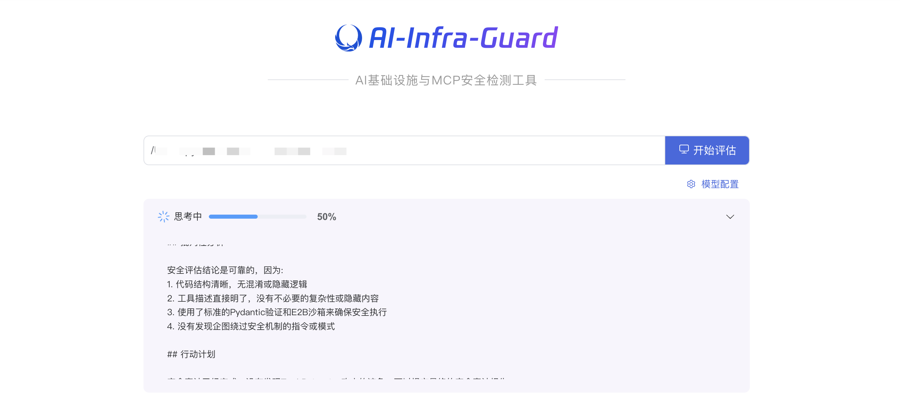
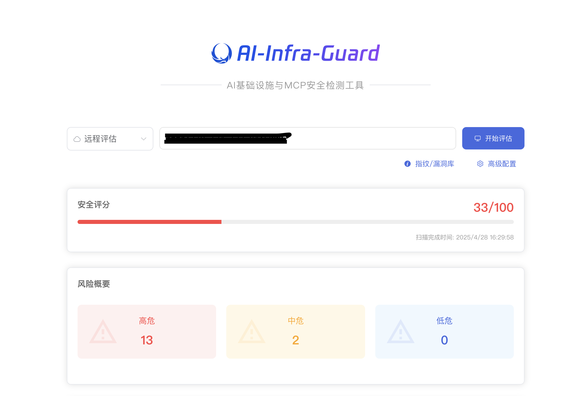

# 🛡️ AI基础设施安全评估系统

AI Infra Guard 是业界首个深度集成MCP安全检测的AI基础设施安全工具，提供全面、智能化的MCP服务代码安全扫描与AI基础设施漏洞发现功能。

- v2版本上线，新增基于AI Agent的MCP Server代码安全扫描

## 🚀 快速预览

**MCP Server代码检测**  
<br>
**基础设施检测**  
<br>

## 🚀 项目亮点

* **更全面的安全检测能力**
  * 支持9类MCP常见安全风险检测，并持续更新
  * 支持28种AI组件框架识别，涵盖200+漏洞指纹
  * 可私有化部署，适合集成到内部安全扫描流水线

* **更智能易用的功能体验**
  * MCP安全检测由AI Agent驱动分析，更低误报漏报
  * AI组件漏洞扫描支持自定义指纹、漏洞YAML规则
  * 开箱即用，无复杂配置，提供Web界面可视化操作

* **轻量级**
  * 核心组件简洁高效
  * 二进制体积小，资源占用低
  * 跨平台支持

## 📋 功能说明

AI Infra Guard的三大核心模块：

1. **AI组件安全扫描 (scan)** - 在命令行中检测AI组件系统中的传统Web安全漏洞
2. **MCP安全检测 (mcp)** - 在命令行中基于AI Agent检测MCP Server代码的安全性
3. **WebUI模式 (webserver)** - 提供Web可视化操作界面

## 📦 安装与使用

### 安装

下载地址: [https://github.com/Tencent/AI-Infra-Guard/releases](https://github.com/Tencent/AI-Infra-Guard/releases)

### 命令行结构

AI Infra Guard采用子命令结构，提供三个主要子命令：

```
ai-infra-guard [子命令] [选项]
```

可用的子命令：

- `scan`: 执行安全漏洞扫描
- `mcp`: MCP Server代码安全检测
- `webserver`: 启动Web界面服务器

### 使用方法

#### WEBUI 可视化操作

```
./ai-infra-guard webserver [--ws-addr 127.0.0.1:8088]
```

#### 安全漏洞扫描 (scan)

**本地一键检测**

```
./ai-infra-guard scan --localscan
```

**单个目标**

```
./ai-infra-guard scan --target [IP/域名] 
```

**多个目标**

```
./ai-infra-guard scan --target [IP/域名] --target [IP/域名]
```

**从文件读取**

```
./ai-infra-guard scan --file target.txt
```

**完整参数**

```
./ai-infra-guard scan --help
```

输出：

```
执行原始的扫描功能，扫描指定目标的安全漏洞。

Usage:
  ai-infra-guard scan [flags]

Flags:
      --ai                      启用AI分析
      --check-vul               验证漏洞模板
      --deepseek-token string   DeepSeek API令牌
  -f, --file string             包含目标URL的文件路径
      --fps string              指纹模板文件或目录 (default "data/fingerprints")
      --header stringArray      HTTP请求头，可以指定多个，例如: --header "key:value" --header "key:value"
  -h, --help                    help for scan
      --hunyuan-token string    混元API令牌
      --lang string             响应语言 zh/en (default "zh")
      --limit int               每秒最大请求数 (default 200)
      --list-vul                列出漏洞模板
      --localscan               一键本地扫描
  -o, --output string           输出文件路径
      --proxy-url string        代理服务器URL
  -t, --target stringArray      目标URL，可以指定多个目标，例如: --target xx.com --target aa.com
      --timeout int             请求超时时间(秒) (default 5)
      --vul string              漏洞数据库目录 (default "data/vuln")
```

#### MCP Server扫描

MCP扫描功能用于检测MCP Server中存在的安全问题，基于AI Agent自动检测代码问题。

**基本使用**
默认的LLM API接口使用OPENAI，可自定义。

```
./ai-infra-guard mcp --code [源代码路径] --model [模型名称] --token [API令牌] --base-url 
```

**指定输出格式**

```
./ai-infra-guard mcp --code [源代码路径] --model [模型名称] --token [API令牌] --csv results.csv --json results.json
```

**完整参数**

```
./ai-infra-guard mcp --help
```

输出：

```

Usage:
  ai-infra-guard mcp [flags]

Flags:
      --base-url string   LLM API基础URL
      --code string       源代码路径
      --csv string        输出 CSV 文件路径
  -h, --help              help for mcp
      --json string       输出 JSON 文件路径
      --log string        日志保存路径
      --model string      AI模型名称
      --plugins string    插件列表，用英文逗号分隔
      --token string      API令牌
```

## 📊 MCP安全风险覆盖情况

| 风险名称                | 风险说明                                                                                                                                                                                                 |
|-------------------------|---------------------------------------------------------------------------------------------------------------------------------------------------------------------------------------------------------|
| 工具投毒攻击            | 恶意MCP服务通过工具描述插入隐藏指令，操纵AI执行未授权操作，窃取敏感数据或执行恶意行为。                                                                                                                 |
| 地毯式骗局              | 恶意MCP服务在用户初次批准或正常工作特定次数后更改行为，从无害工具变为含恶意指令的工具，用户难以察觉。                                                                                                   |
| 工具覆盖攻击            | 恶意MCP服务通过隐藏指令重新定义其他可信MCP工具的行为，例如修改邮件接收者或执行额外操作。                                                                                                               |
| 恶意代码/命令执行       | MCP服务支持直接执行代码或命令，缺乏沙箱隔离，攻击者可利用其在托管服务器或用户本地安装环境执行恶意操作。                                                                                                 |
| 数据窃取                | 恶意MCP服务诱导AI读取并传输敏感数据（如API密钥、SSH密钥），或直接将用户授权后输入的数据发送至外部服务器。                                                                                               |
| 未授权访问/鉴权不当     | MCP服务缺乏授权认证或认证机制存在缺陷，攻击者可绕过验证访问受限资源或用户数据。                                                                                                                         |
| 间接提示词注入          | MCP服务将外部数据（如网页、文档）输出至AI对话，若含恶意指令，可能影响AI决策和行为。                                                                                                                     |
| 包名混淆与抢注攻击      | MCP客户端中已安装的MCP服务名称、工具名称与描述相近，可能导致AI错误调用，或第三方抢注官方MCP服务，并导致后门与投毒风险。                                                                                 |
| 明文存储密钥            | 敏感MCP服务在代码或其它文件中硬编码与存储明文密钥，可能导致数据泄露。                                                                                                                                   |


## 📊 AI组件漏洞覆盖情况

| 组件名称                    | 漏洞数量 |
|-------------------------|------|
| anythingllm             | 8    |
| langchain               | 33   |
| Chuanhugpt              | 0    |
| clickhouse              | 22   |
| comfy_mtb               | 1    |
| ComfyUI-Prompt-Preview  | 1    |
| ComfyUI-Custom-Scripts  | 1    |
| comfyui                 | 1    |
| dify                    | 11   |
| fastchat-webui          | 0    |
| fastchat                | 1    |
| feast                   | 0    |
| gradio                  | 42   |
| jupyterlab              | 6    |
| jupyter-notebook        | 1    |
| jupyter-server          | 13   |
| kubeflow                | 4    |
| kubepi                  | 5    |
| llamafactory            | 1    |
| llmstudio               | 0    |
| ollama                  | 7    |
| open-webui              | 8    |
| pyload-ng               | 18   |
| qanything               | 2    |
| ragflow                 | 2    |
| ray                     | 4    |
| tensorboard             | 0    |
| vllm                    | 4    |
| xinference              | 0    |
| triton-inference-server | 7    |

## 🔍 指纹匹配规则

AI Infra Guard 基于WEB指纹识别组件，指纹规则在[data/fingerprints](./data/fingerprints)
目录中，漏洞匹配规则在[data/vuln](./data/vuln)目录中。

### 示例：Gradio 指纹规则

```yaml
info:
  name: gradio
  author: Security Team
  severity: info
  metadata:
    product: gradio
    vendor: gradio
http:
  - method: GET
    path: '/'
    matchers:
      - body="<script>window.gradio_config = {" || body="document.getElementsByTagName(\"gradio-app\");"
```

### 🛠️ 指纹匹配语法

#### 匹配位置

- 标题（title）
- 正文（body）
- 请求头（header）
- 图标哈希（icon）

#### 逻辑运算符

- `=` 模糊匹配
- `==` 全等
- `!=` 不等
- `~=` 正则匹配
- `&&` 与
- `||` 或
- `()` 括号分组

## 🤝 贡献

我们非常欢迎社区贡献！欢迎提交 [PR](https://github.com/Tencent/AI-Infra-Guard/pulls)
和 [Issue](https://github.com/Tencent/AI-Infra-Guard/issues)。

## Star History

[](https://star-history.com/#Tencent/AI-Infra-Guard&Date)

## 📄 许可证

"AI Infra Guard" is licensed under the MIT License except for the third-party components.
Visited [License.txt](./License.txt)

---

💡 **提示**：持续关注更新，保护您的AI基础设施与MCP安全！