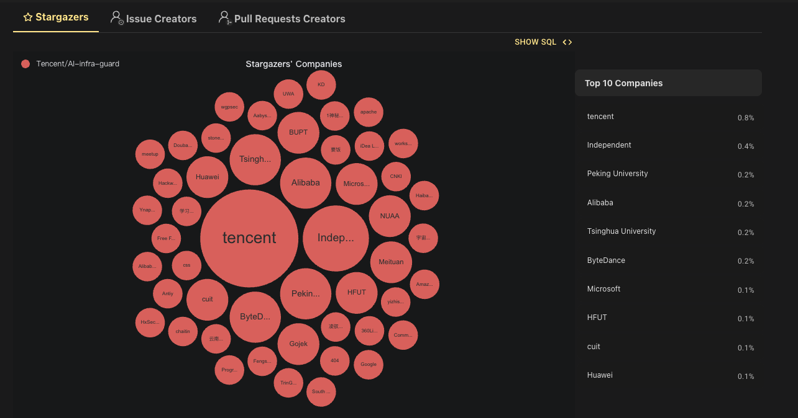

<p align="center">
    <h1 align="center"></h1>
</p>
<h4 align="center">
    <p>
        <a href="https://tencent.github.io/AI-Infra-Guard/">Documentation</a> |
        <a href="#">中文</a> |
        <a href="./README.md">English</a>
    <p>
</h4>
<p align="center">
    <a href="https://github.com/Tencent/AI-Infra-Guard">
        
    </a>
    <a href="https://github.com/Tencent/AI-Infra-Guard">
        
    </a>
    <a href="https://github.com/Tencent/AI-Infra-Guard">
        
    </a>
    <a href="https://github.com/Tencent/AI-Infra-Guard">
        
    </a>
    <a href="https://deepwiki.com/Tencent/AI-Infra-Guard">
       
    </a>
</p>
<p align="center">
  <a href="https://trendshift.io/repositories/13637" target="_blank"></a>
  <a href="https://www.blackhat.com/eu-25/arsenal/schedule/index.html#aigai-infra-guard-48381" target="_blank"></a>
  <a href="https://github.com/deepseek-ai/awesome-deepseek-integration" target="_blank"></a>
</p>

<br>
<p align="center">
    <h3 align="center">🚀 腾讯朱雀实验室推出的一站式 AI 红队安全测试平台</h3>
</p>

**A.I.G (AI-Infra-Guard)** 集成AI基础设施漏洞扫描、MCP Server风险检测与大模型
安全体检等能力，旨在为用户提供最全面、智能与易用的AI安全风险自查解决方案。

<p>
  我们致力于将A.I.G(AI-Infra-Guard)打造为业界领先的 AI 红队工具平台。更多的 Star 能让这个项目被更多人看到，吸引更多的开发者参与进来，从而让项目更快地迭代和完善。您的 Star 对我们至关重要！
</p>
<p align="center">
  <a href="https://github.com/Tencent/AI-Infra-Guard">
      
  </a>
</p>

## 目录
- [✨ 功能特性](#-功能特性)
- [🖼️ 功能展示](#-功能展示)
- [🚀 快速开始](#-快速开始)
- [📖 用户指南](#-用户指南)
- [📝 贡献指南](#-贡献指南)
- [🙏 致谢](#-致谢)
- [💬 加入社区](#-加入社区)
- [📖 引用](#-引用)
- [📚 相关论文](#-相关论文)
- [📄 开源协议](#-开源协议)


## ✨ 功能特性


| 特性 | 详细信息 |
|:--------|:------------|
| **AI基础设施风险检测** | 精准识别30+AI框架组件，覆盖近400个已知CVE漏洞，包括Ollama、ComfyUI、vLLM等 |
| **MCP服务风险检测** | 基于AI Agent驱动，检测9大类MCP安全风险，支持源代码/远程URL扫描 |
| **越狱评估** | 快速评估Prompt安全风险，内置多个精选越狱评估数据集，跨模型安全性能对比 |
| **直观的Web界面** | 现代化、用户友好的Web UI，一键扫描实时进度跟踪，全面的结果分析报告 |
| **多语言支持** | 拥有中英文界面，本地化帮助文档 |
| **跨平台兼容** | 支持Linux、macOS和Windows，基于Docker部署 |
| **免费且MIT开源** | 完全免费使用，MIT开源协议 |


<br />

## 🖼️ 功能展示

### A.I.G 主界面


### AI 基础设施漏洞扫描


### MCP扫描


### 越狱评估


### 插件管理


<br />

## 🚀 快速开始
### Docker 一键部署

**系统要求**

| Docker | 内存 | 磁盘空间 |
|--------|------|----------|
| 20.10 或更高 | 4GB+ | 10GB+ |


**1. 一键安装脚本（推荐）**
```bash
# 此方法会自动帮您安装docker并一键启动A.I.G
curl https://raw.githubusercontent.com/Tencent/AI-Infra-Guard/refs/heads/main/docker.sh | bash
```

**2. 使用预构建镜像运行 (推荐)**
```bash
git clone https://github.com/Tencent/AI-Infra-Guard.git
cd AI-Infra-Guard
# 此方法会从 Docker Hub 拉取预构建的镜像，启动速度更快
docker-compose -f docker-compose.images.yml up -d
```

**3. 从源码构建并运行**
```bash
git clone https://github.com/Tencent/AI-Infra-Guard.git
cd AI-Infra-Guard
# 此方法会使用本地代码构建 Docker 镜像并启动服务
docker-compose up -d
```

服务启动后，您可以通过以下地址访问A.I.G的Web界面：
`http://localhost:8088`
<br>
<br>
## 📖 用户指南

访问我们的在线文档：[https://tencent.github.io/AI-Infra-Guard/](https://tencent.github.io/AI-Infra-Guard/)

更多详细的常见问题解答和故障排除指南，请访问我们的[文档](https://tencent.github.io/AI-Infra-Guard/)。
<br />
<br>

## 📝 贡献指南

A.I.G 的核心能力之一就是其丰富且可快速配置的插件系统。我们欢迎社区贡献高质量的插件和功能。

### 贡献插件规则
1.  **指纹规则**: 在 `data/fingerprints/` 目录下添加新的 YAML 指纹文件
2.  **漏洞规则**: 在 `data/vuln/` 目录下添加新的漏洞检测规则
3.  **MCP 插件**: 在 `data/mcp/` 目录下添加新的 MCP 安全检测规则
4.  **模型评测集**: 在 `data/eval` 目录下添加新的模型评测集

请参考现有规则格式，创建新文件并通过 Pull Request 提交。

### 其他贡献方式
- 🐛 [报告Bug](https://github.com/Tencent/AI-Infra-Guard/issues)
- 💡 [建议新功能](https://github.com/Tencent/AI-Infra-Guard/issues)
- ⭐ [改进文档](https://github.com/Tencent/AI-Infra-Guard/pulls)
<br />
<br />

## 🙏 致谢
### 👥 致敬A.I.G的开源贡献者
感谢所有为A.I.G项目贡献的开发者，您的贡献对A.I.G打造成更强大、更可靠的AI红队平台起到了重要作用。
<br />
<table style="border: none; border-collapse: inherit;">
  <tr>
    <td width="33%" style="border: none;"></td>
    <td width="33%" style="border: none;"></td>
    <td width="33%" style="border: none;"></td>
  </tr>
</table>
<a href="https://github.com/Tencent/AI-Infra-Guard/graphs/contributors">
  
</a>
<br>
<br>

### 🤝 致敬A.I.G的使用者

感谢以下团队和组织对A.I.G的信任和宝贵反馈，帮助我们不断完善产品功能，提升用户体验。您们的支持是我们持续创新的动力源泉。

<br>
<br>
<div align="center">


</div>

<br>
<br>

### 🌟 致敬A.I.G的社区支持者

感谢所有为A.I.G点亮Star的开发者！
<div align="center">
  
</div>
感谢来自<strong>谷歌、微软、亚马逊、字节跳动、阿里巴巴、华为、美团、豆瓣、北京大学、清华大学、合肥工业大学、成都信息工程大学</strong>等公司与学校的支持者！
<br>
<br>
<p align="center">
  ⭐ 每一个Star都激励我们持续改进和创新！ ⭐
</p>
<p align="center">
    🚀 为A.I.G点亮Star帮助我们触达更多开发者。 🚀
</p>

<p align="center">
  <a href="https://github.com/Tencent/AI-Infra-Guard">
      
  </a>
</p>
<br>

## 💬 加入社区

### 🌐 在线讨论
- **GitHub讨论**：[加入我们的社区讨论](https://github.com/Tencent/AI-Infra-Guard/discussions)
- **问题与Bug报告**：[报告问题或建议功能](https://github.com/Tencent/AI-Infra-Guard/issues)

### 📱 讨论社群
<table>
  <thead>
  <tr>
    <th>微信群</th>
    <th>Discord <a href="https://discord.gg/5kRN2ya4">[链接]</a></th>
  </tr>
  </thead>
  <tbody>
  <tr>
    <td></td>
    <td></td>
  </tr>
  </tbody>
</table>

### 📧 联系我们
如有合作咨询或反馈，请联系我们：zhuque@tencent.com


<br>
<br>

## 📖 引用

如果您在研究或产品中使用了A.I.G，请使用以下引用：

```bibtex
@misc{Tencent_AI-Infra-Guard_2025,
  author={{Tencent Zhuque Lab}},
  title={{AI-Infra-Guard: A Comprehensive, Intelligent, and Easy-to-Use AI Red Teaming Platform}},
  year={2025},
  howpublished={GitHub repository},
  url={https://github.com/Tencent/AI-Infra-Guard}
}
```
<br>

## 📚 相关论文

我们深深感谢在学术工作中使用A.I.G，并为推进AI安全研究做出贡献的团队：

[1] Yongjian Guo, Puzhuo Liu, et al. **"Systematic Analysis of MCP Security."** arXiv preprint arXiv:2508.12538 (2025). [[pdf]](https://arxiv.org/abs/2508.12538)  
[2] Zexin Wang, Jingjing Li, et al. **"A Survey on AgentOps: Categorization, Challenges, and Future Directions."** arXiv preprint arXiv:2508.02121 (2025). [[pdf]](https://arxiv.org/abs/2508.02121)  
[3] Yixuan Yang, Daoyuan Wu, Yufan Chen. **"MCPSecBench: A Systematic Security Benchmark and Playground for Testing Model Context Protocols."** arXiv preprint arXiv:2508.13220 (2025). [[pdf]](https://arxiv.org/abs/2508.13220)

📧 如果您在研究中使用了A.I.G，请联系我们，让更多人看到您的研究！
<br>
<br>

## 📄 开源协议

本项目基于 **MIT 许可证** 开源。详细信息请查阅 [License.txt](./License.txt) 文件。

<div>

[](https://star-history.com/#Tencent/AI-Infra-Guard&Date)