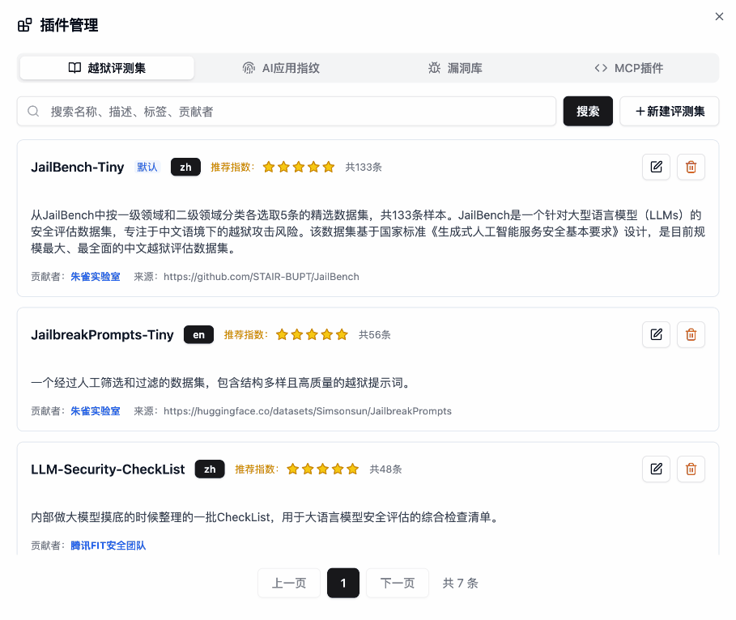

<p align="center">
    <h1 align="center"></h1>
</p>
<h4 align="center">
    <p>
        <a href="https://tencent.github.io/AI-Infra-Guard/">Documentation</a> |
        <a href="./README.md">English</a>
    <p>
</h4>
<p align="center">
    <a href="https://github.com/tencent/AI-Infra-Guard/stargazers">
      
    </a>
    <a href="https://github.com/Tencent/AI-Infra-Guard">
        
    </a>
    <a href="https://github.com/Tencent/AI-Infra-Guard">
        
    </a>
    <a href="https://github.com/Tencent/AI-Infra-Guard">
        
    </a>
    <a href="https://deepwiki.com/Tencent/AI-Infra-Guard">
       
    </a>
</p>
<p align="center">
  <a href="https://trendshift.io/repositories/13637" target="_blank"></a>
  <a href="https://www.blackhat.com/eu-25/arsenal/schedule/index.html#aigai-infra-guard-48381" target="_blank"></a>
  <a href="https://github.com/deepseek-ai/awesome-deepseek-integration" target="_blank"></a>
</p>

<br>

<p align="center">
    <h3 align="center">🚀 腾讯朱雀实验室推出的一站式 AI 红队安全测试平台</h3>
</p>

**A.I.G (AI-Infra-Guard)** 集成AI基础设施漏洞扫描、MCP Server风险检测与大模型安全体检等能力，旨在为用户提供最全面、智能与易用的AI安全风险自查解决方案。

<p>
  我们致力于将A.I.G(AI-Infra-Guard)打造为业界领先的 AI 红队工具平台。更多的 Star 能让这个项目被更多人看到，吸引更多的开发者参与进来，从而让项目更快地迭代和完善。您的 Star 对我们至关重要！
</p>
<p align="center">
  <a href="https://github.com/Tencent/AI-Infra-Guard">
      
  </a>
</p>

> 📢 **News**:
> * A.I.G v3.6.0-rc1 在AI工具协议扫描中新增了Skills安全评估能力；通过重点关注网络层漏洞，减少了漏洞误报。[查看完整更新日志](./CHANGELOG.md)
> * A.I.G V3.5.0 正式版在架构模块化、系统稳定性及检测能力上进行了全面升级，欢迎大家更新体验。[查看完整更新日志](./CHANGELOG.md)

## 目录
- [🚀 快速开始](#-快速开始)
- [✨ 功能特性](#-功能特性)
- [🖼️ 功能展示](#-功能展示)
- [📖 用户指南](#-用户指南)
- [🔧 API文档](#-api文档)
- [📝 贡献指南](#-贡献指南)
- [🙏 致谢](#-致谢)
- [💬 加入社区](#-加入社区)
- [📖 引用](#-引用)
- [📚 相关论文](#-相关论文)
- [📄 开源协议](#-开源协议)

## 🚀 快速开始
### Docker 一键部署

| Docker | 内存 | 磁盘空间 |
|--------|------|----------|
| 20.10 或更高 | 4GB+ | 10GB+ |

```bash
# 此方法会从 Docker Hub 拉取预构建的镜像
git clone https://github.com/Tencent/AI-Infra-Guard.git
cd AI-Infra-Guard
# Docker Compose V2+ 请将 'docker-compose' 替换为 'docker compose'
docker-compose -f docker-compose.images.yml up -d
```

服务启动后，您可以通过以下地址访问 A.I.G 的 Web 界面：
`http://localhost:8088`
<br>

<details>
<summary><strong>📦 更多安装方式</strong></summary>

### 其他安装方式

**方式 2：一键安装脚本（推荐）**
```bash
# 此方法将自动安装 Docker 并启动 A.I.G
curl https://raw.githubusercontent.com/Tencent/AI-Infra-Guard/refs/heads/main/docker.sh | bash
```

**方式 3：源码编译运行**
```bash
git clone https://github.com/Tencent/AI-Infra-Guard.git
cd AI-Infra-Guard
# 此方法从本地源代码构建 Docker 镜像并启动服务
# (Docker Compose V2+ 请将 'docker-compose' 替换为 'docker compose')
docker-compose up -d
```

注意：AI-Infra-Guard 项目定位为企业或个人内部使用的 AI 红队测试平台，目前暂无鉴权认证机制，请勿在公网环境中部署使用。

更多信息请参阅：[https://tencent.github.io/AI-Infra-Guard/?menu=getting-started](https://tencent.github.io/AI-Infra-Guard/?menu=getting-started)

</details>

### 体验在线Pro版
体验具有内测及高级功能的Pro版，需要邀请码，优先提供给提交过 Issues、Pull Requests 或 Discussions，或积极帮助社区发展的贡献者。访问：[https://aigsec.ai/](https://aigsec.ai/)
<br/>
<br/>

## ✨ 功能特性


| 特性 | 详细信息 |
|:--------|:------------|
| **AI基础设施漏洞扫描** | 精准识别30+AI框架组件，覆盖400+已知CVE漏洞，包括Ollama/ComfyUI/vLLM等 |
| **AI工具协议扫描** | 基于AI Agent驱动，检测14大类MCP Server与Skills安全风险，支持源代码/远程URL扫描 |
| **大模型安全体检** | 快速评估Prompt安全风险，内置多个精选越狱评估数据集，支持多种越狱攻击算子，跨模型安全性能对比 |

<details>
<summary><strong>其他优势</strong></summary>

- 🖥️ **现代化Web界面**：用户友好的UI，一键扫描和实时进度跟踪
- 🔌 **完整API**：完整的接口文档和Swagger规范，便于集成
- 🌐 **多语言支持**：中英文界面，本地化文档
- 🐳 **跨平台兼容**：支持Linux、macOS和Windows，基于Docker部署
- 🆓 **免费且开源**：完全免费，MIT开源协议
</details>

<br />

## 🖼️ 功能展示

### A.I.G 主界面




<br />


## 📖 用户指南

访问我们的在线文档：[https://tencent.github.io/AI-Infra-Guard/](https://tencent.github.io/AI-Infra-Guard/)

更多详细的常见问题解答和故障排除指南，请访问我们的[文档](https://tencent.github.io/AI-Infra-Guard/?menu=faq)。
<br />
<br>

## 🔧 API文档

A.I.G 提供了一套创建任务相关的API接口，支持AI基础设施扫描、MCP安全扫描和大模型安全体检功能。

项目运行后访问 `http://localhost:8088/docs/index.html` 可查看完整的API文档

详细的API使用说明、参数说明和完整示例代码，请查看 [完整API文档](./api_zh.md)。
<br />
<br>

## 📝 贡献指南

A.I.G 的核心能力之一就是其丰富且可快速配置的插件系统。我们欢迎社区贡献高质量的插件和功能。

### 贡献插件规则
1.  **指纹规则**: 在 `data/fingerprints/` 目录下添加新的 YAML 指纹文件
2.  **漏洞规则**: 在 `data/vuln/` 目录下添加新的漏洞检测规则
3.  **MCP 插件**: 在 `data/mcp/` 目录下添加新的 MCP 安全检测规则
4.  **模型评测集**: 在 `data/eval` 目录下添加新的模型评测集

请参考现有规则格式，创建新文件并通过 Pull Request 提交。

### 其他贡献方式
- 🐛 [报告Bug](https://github.com/Tencent/AI-Infra-Guard/issues)
- 💡 [建议新功能](https://github.com/Tencent/AI-Infra-Guard/issues)
- ⭐ [改进文档](https://github.com/Tencent/AI-Infra-Guard/pulls)
<br />
<br />

## 🙏 致谢

### 🎓 学术合作

我们诚挚感谢学术合作伙伴提供的卓越研究协作。

#### 
<table>
  <tr>
    <td align="center" width="90">
      <a href="#">
        
      </a>
      <br />
      <a href="#">
        <sub><b>李挥教授</b></sub>
      </a>
    </td>
    <td align="center" width="90">
      <a href="https://github.com/TheBinKing">
        
      </a>
      <br />
      <a href="mailto:1546697086@qq.com">
        <sub><b>王滨</b></sub>
      </a>
    </td>
    <td align="center" width="90">
      <a href="https://github.com/KPGhat">
        
      </a>
      <br />
      <a href="mailto:kpghat@gmail.com">
        <sub><b>刘泽心</b></sub>
      </a>
    </td>
    <td align="center" width="90">
      <a href="https://github.com/GioldDiorld">
        
      </a>
      <br />
      <a href="mailto:g.diorld@gmail.com">
        <sub><b>余昊</b></sub>
      </a>
    </td>
    <td align="center" width="90">
      <a href="https://github.com/Jarvisni">
        
      </a>
      <br />
      <a href="mailto:719001405@qq.com">
        <sub><b>杨傲</b></sub>
      </a>
    </td>
    <td align="center" width="90">
      <a href="https://github.com/Zhengxi7">
        
      </a>
      <br />
      <a href="mailto:linzhengxi7@126.com">
        <sub><b>林郑熹</b></sub>
      </a>
    </td>
  </tr>
</table>

#### 

<table>
  <tr>
    <td align="center" width="120">
      <a href="https://yangzhemin.github.io/">
        
      </a>
      <br />
      <a href="mailto:yangzhemin@fudan.edu.cn">
        <sub><b>杨哲慜教授</b></sub>
      </a>
    </td>
    <td align="center" width="100">
      <a href="https://github.com/kangwei-zhong">
        
      </a>
      <br />
      <a href="mailto:kwzhong23@m.fudan.edu.cn">
        <sub><b>钟康维</b></sub>
      </a>
    </td>
    <td align="center" width="90">
      <a href="https://github.com/MoonBirdLin">
        
      </a>
      <br />
      <a href="mailto:linjp23@m.fudan.edu.cn">
        <sub><b>林佳鹏</b></sub>
      </a>
    </td>
    <td align="center" width="90">
      <a href="https://vanilla-tiramisu.github.io/">
        
      </a>
      <br />
      <a href="mailto:csheng25@m.fudan.edu.cn">
        <sub><b>盛铖</b></sub>
      </a>
    </td>
  </tr>
</table>
<br>

### 👥 感谢以下团队与开发者的专业共建与代码贡献
<br />
<table style="border: none; border-collapse: inherit;">
  <tr>
    <td width="33%" style="border: none;"></td>
    <td width="33%" style="border: none;"></td>
    <td width="33%" style="border: none;"></td>
  </tr>
</table>
<a href="https://github.com/Tencent/AI-Infra-Guard/graphs/contributors">
  
</a>
<br>
<br>

### 🤝 感谢以下使用A.I.G的企业与团队用户

<br>
<div align="center">


</div>

<br>
<br>

## 💬 加入社区

### 🌐 在线讨论
- **GitHub讨论**：[加入我们的社区讨论](https://github.com/Tencent/AI-Infra-Guard/discussions)
- **问题与Bug报告**：[报告问题或建议功能](https://github.com/Tencent/AI-Infra-Guard/issues)

### 📱 讨论社群
<table>
  <thead>
  <tr>
    <th>微信群</th>
    <th>Discord <a href="https://discord.gg/U9dnPnyadZ">[链接]</a></th>
  </tr>
  </thead>
  <tbody>
  <tr>
    <td></td>
    <td></td>
  </tr>
  </tbody>
</table>

### 📧 联系我们
如有合作咨询或反馈，请联系我们：[zhuque@tencent.com](mailto:zhuque@tencent.com)

### 🔗 更多安全工具
如果你对代码安全感兴趣，推荐关注腾讯悟空代码安全团队开源的行业首个项目级 AI 生成代码安全性评测框架[A.S.E（AICGSecEval）](https://github.com/Tencent/AICGSecEval)。

<br>
<br>

## 📖 引用

如果您在研究或产品中使用了A.I.G，请使用以下引用：

```bibtex
@misc{Tencent_AI-Infra-Guard_2025,
  author={{Tencent Zhuque Lab}},
  title={{AI-Infra-Guard: A Comprehensive, Intelligent, and Easy-to-Use AI Red Teaming Platform}},
  year={2025},
  howpublished={GitHub repository},
  url={https://github.com/Tencent/AI-Infra-Guard}
}
```
<br>

## 📚 相关论文

我们深深感谢在学术工作中使用A.I.G，并为推进AI安全研究做出贡献的团队：

[1] Ruiqi Li, Zhiqiang Wang, Yunhao Yao et al. **"MCP-ITP: An Automated Framework for Implicit Tool Poisoning in MCP."** arXiv preprint arXiv:2601.07395v1 (2026). [[pdf]](http://arxiv.org/abs/2601.07395v1)  
[2] Jingxiao Yang, Ping He, Tianyu Du et al. **"HogVul: Black-box Adversarial Code Generation Framework Against LM-based Vulnerability Detectors."** arXiv preprint arXiv:2601.05587v1 (2026). [[pdf]](http://arxiv.org/abs/2601.05587v1)  
[3] Yunyi Zhang, Shibo Cui, Baojun Liu et al. **"Beyond Jailbreak: Unveiling Risks in LLM Applications Arising from Blurred Capability Boundaries."** arXiv preprint arXiv:2511.17874v2 (2025). [[pdf]](http://arxiv.org/abs/2511.17874v2)  
[4] Teofil Bodea, Masanori Misono, Julian Pritzi et al. **"Trusted AI Agents in the Cloud."** arXiv preprint arXiv:2512.05951v1 (2025). [[pdf]](http://arxiv.org/abs/2512.05951v1)  
[5] Christian Coleman. **"Behavioral Detection Methods for Automated MCP Server Vulnerability Assessment."** [[pdf]](https://digitalcommons.odu.edu/cgi/viewcontent.cgi?article=1138&context=covacci-undergraduateresearch)  
[6] Bin Wang, Zexin Liu, Hao Yu et al. **"MCPGuard : Automatically Detecting Vulnerabilities in MCP Servers."** arXiv preprint arXiv:22510.23673v1 (2025). [[pdf]](http://arxiv.org/abs/2510.23673v1)  
[7] Weibo Zhao, Jiahao Liu, Bonan Ruan et al. **"When MCP Servers Attack: Taxonomy, Feasibility, and Mitigation."** arXiv preprint arXiv:2509.24272v1 (2025). [[pdf]](http://arxiv.org/abs/2509.24272v1)  
[8] Ping He, Changjiang Li, et al. **"Automatic Red Teaming LLM-based Agents with Model Context Protocol Tools."** arXiv preprint arXiv:2509.21011 (2025). [[pdf]](https://arxiv.org/abs/2509.21011)  
[9] Yixuan Yang, Daoyuan Wu, Yufan Chen. **"MCPSecBench: A Systematic Security Benchmark and Playground for Testing Model Context Protocols."** arXiv preprint arXiv:2508.13220 (2025). [[pdf]](https://arxiv.org/abs/2508.13220)  
[10] Zexin Wang, Jingjing Li, et al. **"A Survey on AgentOps: Categorization, Challenges, and Future Directions."** arXiv preprint arXiv:2508.02121 (2025). [[pdf]](https://arxiv.org/abs/2508.02121)  
[11] Yongjian Guo, Puzhuo Liu, et al. **"Systematic Analysis of MCP Security."** arXiv preprint arXiv:2508.12538 (2025). [[pdf]](https://arxiv.org/abs/2508.12538)  

📧 如果您在研究中使用了A.I.G，请联系我们，让更多人看到您的研究！
<br>
<br>

## 📄 开源协议

本项目基于 **MIT 许可证** 开源。详细信息请查阅 [License.txt](./License.txt) 文件。

<div>

[](https://star-history.com/#Tencent/AI-Infra-Guard&Date)