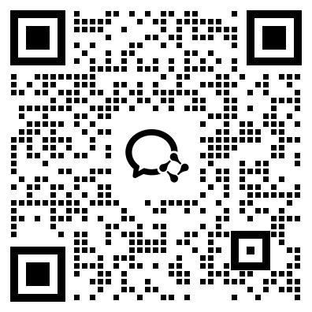

**A.I.G (AI-Infra-Guard)** is a comprehensive, intelligent, and user-friendly AI Red Teaming security testing platform developed by Tencent Zhuque Lab.

## Core Features

- **AI Infrastructure Vulnerability Scanning**: Detects known CVE vulnerabilities in the web services of various frameworks and components (e.g., Ollama, ComfyUI) used in AI training, deployment, and application building, through precise fingerprinting.
- **MCP Server Security Detection**: Utilizes AI Agents to intelligently detect security threats in MCP Servers, such as tool poisoning and code vulnerabilities, helping MCP developers and app marketplaces complete security certification before release.
- **Large Model Security Health Check**: Employs high-quality and diverse evaluation datasets to automatically assess the overall security of different large models when faced with malicious, adversarial, or deceptive prompt inputs. It exports bad cases for security alignment and guardrail reinforcement.

## Collaboration and Contribution
We welcome teams both inside and outside the company to join us in building the industry's best AI Red Teaming security testing platform. A.I.G is now open-source on [Github](https://github.com/Tencent/AI-Infra-Guard) and supports rapid configuration of AI component fingerprints, CVE vulnerability fingerprints, jailbreak evaluation sets, and MCP detection plugins through its plugin management system.

## Contact Us

We welcome feedback on platform bugs and contributions to enhance detection capabilities. Feel free to join the A.I.G communication group for discussions.

    

