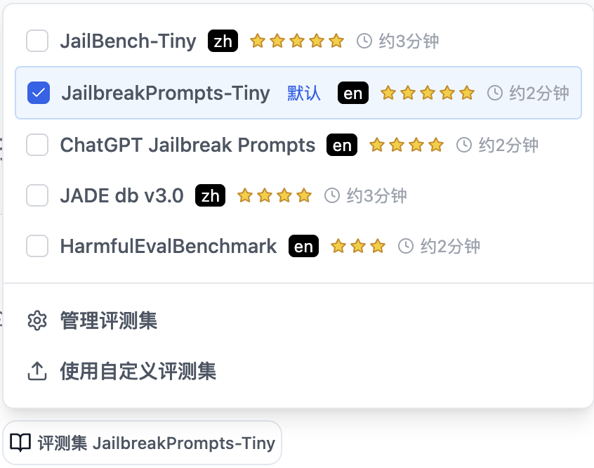

# Prompt Security Evaluation

## Introduction

Prompt Security Evaluation provides a simple, efficient, and comprehensive way to test the security capabilities of large models. The "Large Model Security Health Check" allows you to discover security issues with one click, helping developers efficiently identify and mitigate security risks.

## Quick Start

### Complete in Three Steps

1. **Select Task Type**: Click "Large Model Security Health Check" below the dialog box.
2. **Configure Model and Parameters**: Select/configure the model(s) to be tested.
   - **Security Health Check**: Choose from built-in datasets or upload a custom dataset (see Custom Dataset Management for details).
3. **Start Task and View Report**: Click the button, wait for the task to complete, and then view the detailed results report.

## Main Functional Modules

### 1. Large Model Configuration

- **Supported Model Types**: Compatible with models that follow the OpenAI API format.
- **Configuration Parameters**:
  - Model Name, e.g., `openai/gpt-4o`
  - API Base URL, e.g., `https://openrouter.ai/api/v1`
  - API Key

### 2. Large Model Security Health Check

**Dataset Selection:**
- Built-in, curated security test datasets covering major security scenarios.
- Support for using custom datasets (see Custom Dataset Management for details).
- Automatic estimation of task execution time for better planning.

**Health Check Execution:**
- Supports single-model or multi-model parallel health checks.
- Automatically generates detailed security scores and risk reports.
- Provides comparative analysis of security performance between models.

**Report Display:**
- Visualized presentation of health check results, including success/failure rates, risk analysis, etc.
- Model security ratings: High, Medium, Low.
- Supports exporting the full set of results data.

### 3. Custom Dataset Management

The system supports two ways to use custom datasets:

**Temporary Upload:**
- Uploaded temporarily when executing a health check task; not saved after the task is complete.
- Compatible with major formats (CSV, JSON, JSONL, Excel, Parquet, TXT).
- Automatically recognizes common prompt column names (e.g., prompt, question, query, text, content).

> Note: Future versions will support user-defined column name configurations.

**Dataset Management:**
- Permanently save datasets to the system through the management page for repeated use and sharing.
- Requires standard JSON format to ensure data quality and consistency.

> Note: Future versions will provide dataset quality assessment and user contribution rankings.