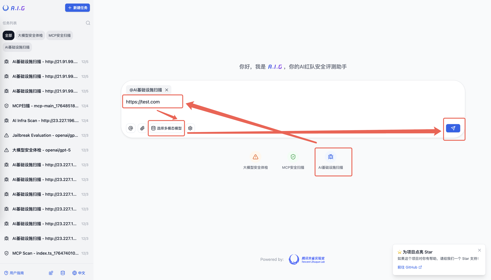
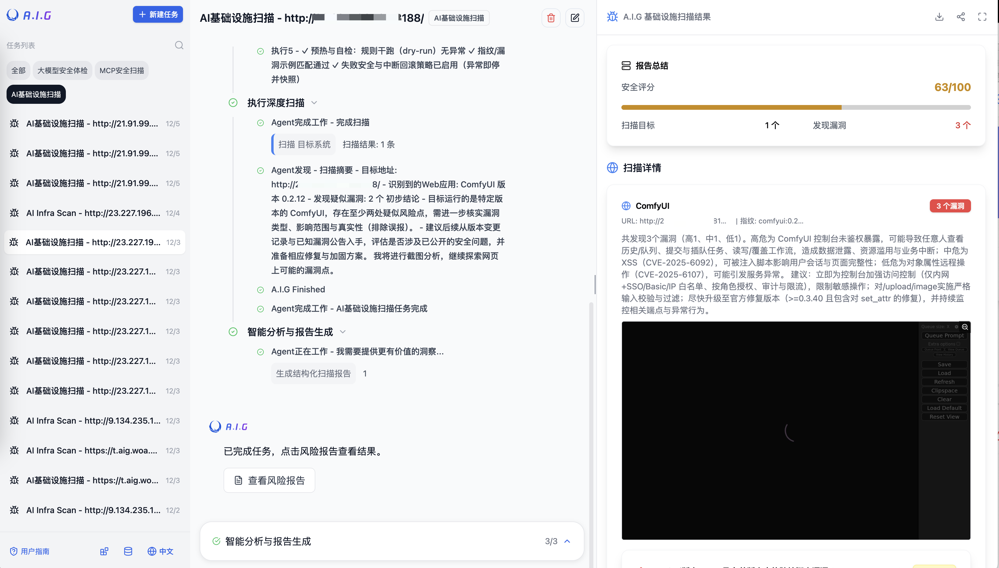
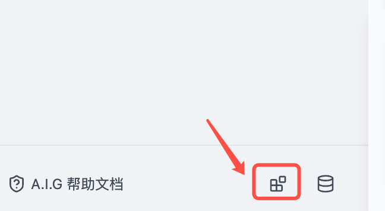
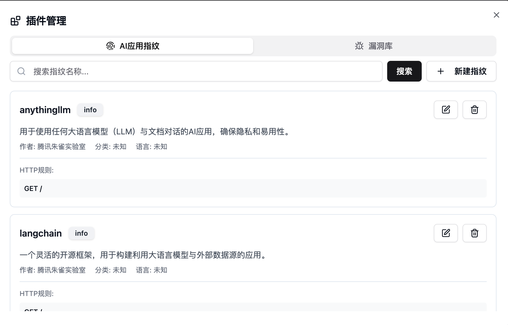

# 3. AI基础设施安全扫描

A.I.G基础设施安全扫描会根据内置的指纹库，快速识别目标站点的组件信息，并匹配相应的漏洞。

## 快速使用



1. 点击 “AI基础设施扫描”
2. 内容填入url，可多行，也支持从txt导入url
3. 点击扫描



## 内置指纹库





## AI组件漏洞覆盖

A.I.G使用基于YAML的规则进行Web组件指纹识别和漏洞匹配。 

*   **指纹规则**: 存放在 `data/fingerprints` 目录中。 
*   **漏洞规则**: 存放在 `data/vuln` 目录中。 

您可以根据需要添加或修改这些规则，以扩展A.I.G的检测能力。

AI Infra Guard 支持检测多种AI相关组件的已知漏洞：

| 组件名称                 | 漏洞数量 |
|--------------------------|----------|
| anythingllm              | 8        |
| langchain                | 33       |
| Chuanhugpt               | 0        |
| clickhouse               | 22       |
| comfy_mtb                | 1        |
| ComfyUI-Prompt-Preview   | 1        |
| ComfyUI-Custom-Scripts   | 1        |
| comfyui                  | 1        |
| dify                     | 11       |
| fastchat-webui           | 0        |
| fastchat                 | 1        |
| feast                    | 0        |
| gradio                   | 42       |
| jupyterlab               | 6        |
| jupyter-notebook         | 1        |
| jupyter-server           | 13       |
| kubeflow                 | 4        |
| kubepi                   | 5        |
| llamafactory             | 1        |
| llmstudio                | 0        |
| ollama                   | 7        |
| open-webui               | 8        |
| pyload-ng                | 18       |
| qanything                | 2        |
| ragflow                  | 2        |
| ray                      | 4        |
| tensorboard              | 0        |
| vllm                     | 4        |
| xinference               | 0        |
| triton-inference-server  | 7        |
| **总计**                 | **200+** |

*注：漏洞库持续更新中。*

## 🔍 AI组件指纹匹配规则

AI Infra Guard 使用基于YAML的规则进行Web指纹识别和漏洞匹配。

*   **指纹规则**: 存储在 `data/fingerprints` 目录。
*   **漏洞规则**: 存储在 `data/vuln` 目录。

### 示例：Gradio 指纹规则 (`data/fingerprints/gradio.yaml`)

```yaml
info:
  name: gradio
  author: Security Team
  severity: info
  metadata:
    product: gradio
    vendor: gradio
http:
  - method: GET
    path: '/'
    matchers:
      # 匹配响应体中是否包含Gradio特有的JavaScript配置或元素
      - body="<script>window.gradio_config = {" || body="document.getElementsByTagName(\"gradio-app\");"
```

### 指纹匹配语法

#### 匹配位置

*   `title`: HTML 页面标题
*   `body`: HTTP 响应正文
*   `header`: HTTP 响应头
*   `icon`: 网站图标 (favicon) 的哈希值

#### 逻辑运算符

*   `=`: 模糊包含匹配 (大小写不敏感)
*   `==`: 精确等于匹配 (大小写敏感)
*   `!=`: 不等于匹配
*   `~=`: 正则表达式匹配
*   `&&`: 逻辑与
*   `||`: 逻辑或
*   `()`: 用于分组，改变运算优先级

