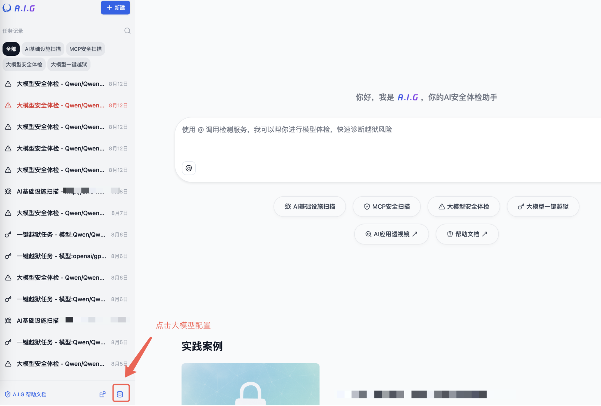

# 快速开始

本章节将指导您如何快速部署和使用A.I.G。

**系统要求**

- Docker 20.10 或更高版本
- 4GB+ 可用内存
- 10GB+ 可用磁盘空间


**方法 1：一键安装脚本（推荐）**
```bash
# 该方法将自动安装 Docker 并启动 A.I.G
curl https://raw.githubusercontent.com/Tencent/AI-Infra-Guard/refs/heads/main/docker.sh | bash
```

**方法 2：使用预构建镜像运行（推荐）**
```bash
git clone https://github.com/Tencent/AI-Infra-Guard.git
cd AI-Infra-Guard
# 该方法从 Docker Hub 拉取预构建镜像以便快速启动
docker-compose -f docker-compose.images.yml up -d
```

**方法 3：源码构建并运行**
```bash
git clone https://github.com/Tencent/AI-Infra-Guard.git
cd AI-Infra-Guard
# 该方法从本地源码构建 Docker 镜像并启动服务
docker-compose up -d
```

安装完成后，您可以通过浏览器访问 `http://localhost:8088` 来使用A.I.G的Web界面。

**目录结构**

| 目录/文件           | 描述                                                         | 挂载路径                        |
|---------------------|--------------------------------------------------------------|---------------------------------|
| `uploads/`          | 上传文件目录                                                     | `/ai-infra-guard/uploads`       |
| `db/`               | 数据库文件目录                                               | `/ai-infra-guard/db`            |
| `data/`             | 知识库数据目录（越狱评测集、指纹、漏洞）                                 | `/ai-infra-guard/data`          |
| `logs/`             | 应用日志目录                                                 | `/ai-infra-guard/logs`          |

## 配置模型KEY

A.I.G 需要使用到大模型API。若需要使用这两个功能，可以先配置大模型API KEY。



配置大模型必须的 模型名称、API Key、Base URL，后点击保存即可。


## 常见问题

1.**端口冲突**
   ```bash
   # 修改webserver端口映射
   ports:
     - "8080:8088"  # 使用8080端口
   ```
2.**权限问题**
   ```bash
   # 检查数据目录权限
   sudo chown -R $USER:$USER ./data
   ```
3.**服务启动失败**
   ```bash
   # 查看详细日志
   docker-compose logs webserver
   docker-compose logs agent
   ```
4.**停止服务**
   ```bash
    # 停止服务
    docker-compose down
    
    # 停止服务并删除数据卷（谨慎使用）
    docker-compose down -v
   ```


## 更新升级

```bash
# 重新构建并启动
docker-compose -f docker-compose.images.yml up -d --build
# 清理旧镜像
docker image prune -f
```