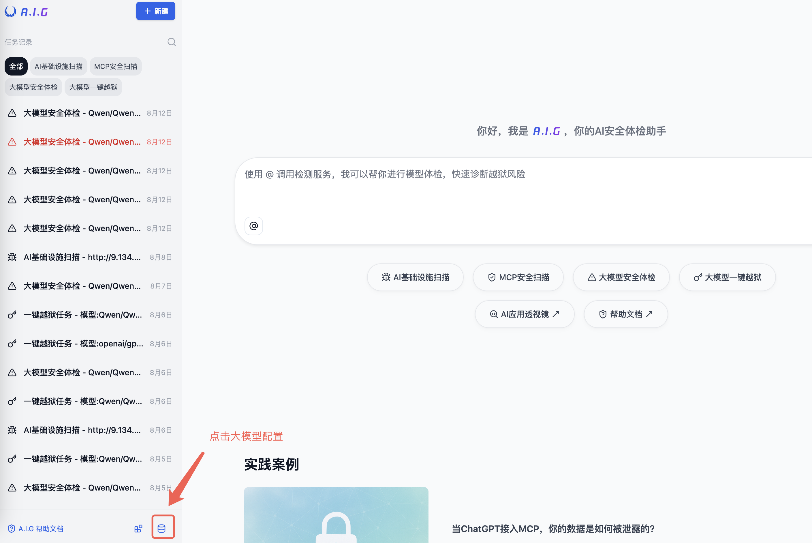
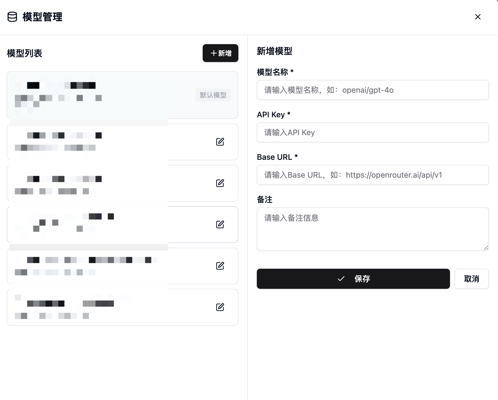

# 2. 快速开始

本章节将指导您如何快速部署和使用A.I.G。

## 一键安装

### 基于Docker部署
```bash
docker-compose -f docker-compose.images.yml up -d
```

安装完成后，您可以通过浏览器访问 `http://localhost:8088` 来使用A.I.G的Web界面。

## 配置模型KEY

A.I.G 的`MCP扫描`、`大模型安全体检`功能需要使用到大模型API。若需要使用这两个功能，可以先配置大模型API KEY。



配置大模型必须的 模型名称、API Key、Base URL，后点击保存即可。




## 常见问题

1. **端口冲突**
   ```bash
   # 修改webserver端口映射
   ports:
     - "8080:8088"  # 使用8080端口
   ```

2. **权限问题**
   ```bash
   # 检查数据目录权限
   sudo chown -R $USER:$USER ./data
   ```

3. **服务启动失败**
   ```bash
   # 查看详细日志
   docker-compose logs webserver
   docker-compose logs agent
   ```

4. **停止服务**
    ```bash
    # 停止服务
    docker-compose down
    
    # 停止服务并删除数据卷（谨慎使用）
    docker-compose down -v
    ```


## 更新升级

```bash
# 重新构建并启动
docker-compose -f docker-compose.images.yml up -d --build
# 清理旧镜像
docker image prune -f
```