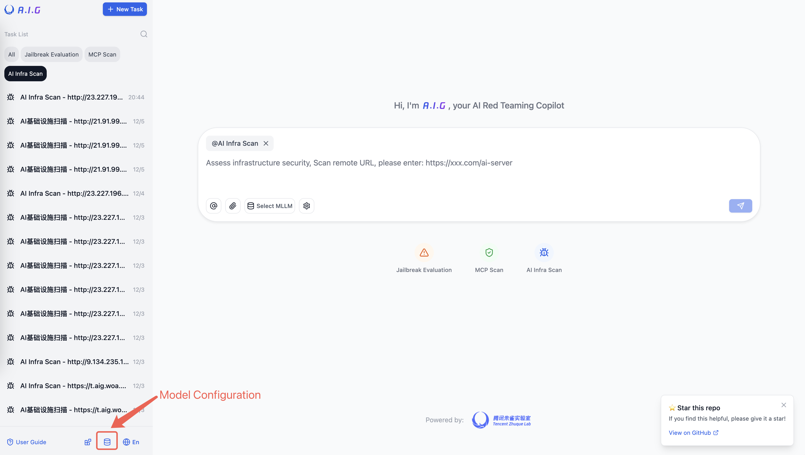
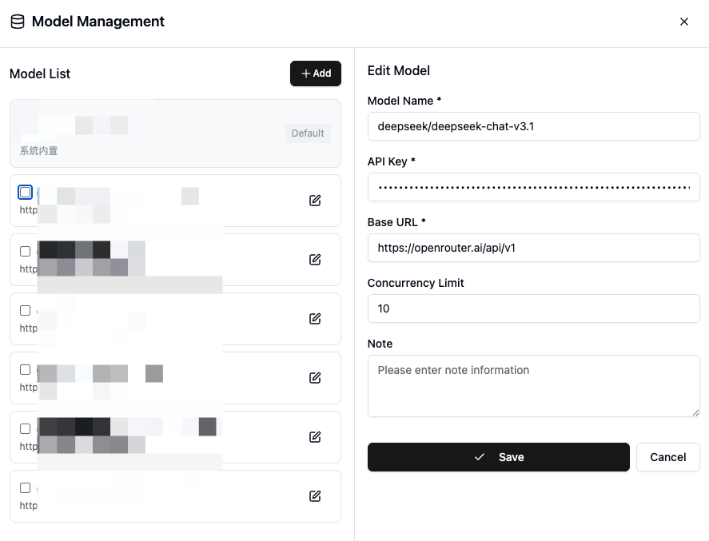

# Getting Started

This section will guide you on how to quickly deploy and use A.I.G.

**System Requirements**

- Docker 20.10 or higher
- At least 4GB of available RAM
- At least 10GB of available disk space


**1. One-Click Install Script （Recommended）**
```bash
# This method will automatically install Docker and launch A.I.G with one command  
curl https://raw.githubusercontent.com/Tencent/AI-Infra-Guard/refs/heads/main/docker.sh | bash
```

**2. Run with pre-built images (Recommended)**
```bash
git clone https://github.com/Tencent/AI-Infra-Guard.git
cd AI-Infra-Guard
# This method pulls pre-built images from Docker Hub for a faster start
docker-compose -f docker-compose.images.yml up -d
```

**3. Build from source and run**
```bash
git clone https://github.com/Tencent/AI-Infra-Guard.git
cd AI-Infra-Guard
# This method builds a Docker image from local source code and starts the service
docker-compose up -d
```

Once the installation is complete, you can access the A.I.G Web UI by visiting `http://localhost:8088` in your browser.

**Directory Structure**

| Directory/File      | Description                                                 | Mount Path                      |
|---------------------|-------------------------------------------------------------|---------------------------------|
| `uploads/`          | Uploads directory                                           | `/ai-infra-guard/uploads`       |
| `db/`               | Database file directory                                     | `/ai-infra-guard/db`            |
| `data/`             | Knowledge base data directory (fingerprints, vulnerabilities) | `/ai-infra-guard/data`          |
| `logs/`             | Application log directory                                   | `/ai-infra-guard/logs`          |


## 🔑 LLM API Requirement
The `MCP Scan` and `Jailbreak Evaluation` features require an LLM API key.
**Configure your key in Settings** before using these services.



Fill in the Model Name, API Key, and Base URL, then click Save.




## Frequently Asked Questions

1.**Port Conflict**
   ```bash
   # Modify the webserver port mapping
   ports:
     - "8080:8088"  # Use port 8080
   ```

2.**Permission Issues**
   ```bash
   # Ensure the data directory has read/write permissions
   sudo chown -R $USER:$USER ./data
   ```

3.**Service Startup Failure**
   ```bash
   # View detailed logs
   docker-compose logs webserver
   docker-compose logs agent
   ```

4.**Stopping the Service**
   ```bash
   # Stop the service
   docker-compose down
   # Stop the service and remove data volumes (use with caution)
   docker-compose down -v
   ```

## Updating the Deployment

To upgrade to the latest version and clean up obsolete resources:

```bash
# Rebuild container images and restart services
docker-compose -f docker-compose.images.yml up -d --build
# Prune dangling Docker images (optional cleanup)
docker image prune -f
```
