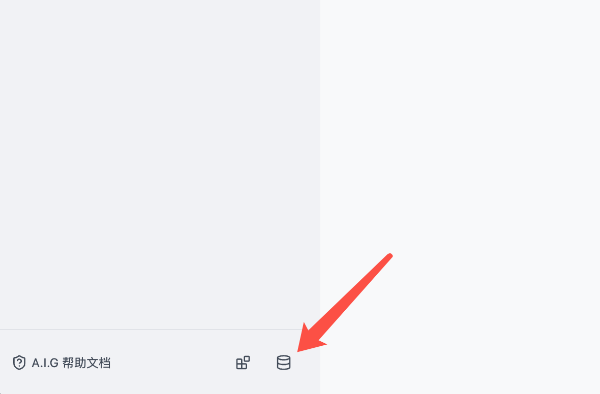

# 4. MCP安全扫描

A.I.G使用了基于AI Agent驱动的MCP Server检测方案，支持MCP Server源代码安全审计与远程MCP Server URL安全扫描。

AI Infra Guard 可检测以下常见的MCP安全风险，并持续更新：

| 风险名称             | 风险说明                                                                                                                                                                                                 |
|----------------------|---------------------------------------------------------------------------------------------------------------------------------------------------------------------------------------------------------|
| 工具投毒攻击         | 恶意MCP Server通过工具描述注入隐藏指令，操纵AI Agent执行未授权操作（例如窃取数据、执行恶意行为）。                                                                                                           |
| 地毯式骗局           | 恶意MCP Server在初期表现正常，但在用户批准或运行若干次后改变行为，执行恶意指令，导致难以察觉的恶意行为。                                                                                                     |
| 工具覆盖攻击         | 恶意MCP Server通过隐藏指令重新定义其他可信MCP Server工具的行为（例如修改邮件接收者、执行额外操作）。                                                                                                         |
| 恶意代码/命令执行    | MCP Server若支持直接执行代码或命令且缺乏沙箱隔离，可能被攻击者利用在服务器或用户本地执行恶意操作。                                                                                                       |
| 数据窃取             | 恶意MCP Server诱导AI Agent读取并传输敏感数据（例如API密钥、SSH密钥），或直接将用户授权输入的数据发送至外部服务器。                                                                                             |
| 未授权访问/鉴权不当  | MCP Server缺乏有效授权认证或存在缺陷，导致攻击者可绕过验证访问受限资源或用户数据。                                                                                                                       |
| 间接提示词注入       | MCP Server将包含恶意指令的外部数据（例如网页、文档）输出给AI Agent，可能影响AI Agent的决策和行为。                                                                                                               |
| 包名混淆与抢注攻击   | 恶意MCP Server使用与可信服务相似的名称、工具名或描述，诱导AI Agent错误调用；或第三方抢注官方MCP Server名称，植入后门。                                                                                       |
| 明文存储密钥         | MCP Server在代码或配置文件中硬编码或明文存储敏感密钥，易导致泄露风险。                                                                                                                                 |

## a) MCP服务源代码扫描

### 添加模型

### 上传MCP附件

1. 选择“MCP安全扫描”
2. 添加附件上传MCP代码
3. 开始扫描

### 基于Github扫描

1. 选择“MCP安全扫描”
2. 输入框输入GitHub地址
3. 开始扫描

## b) 远程MCP服务扫描

1. 选择“MCP安全扫描”
2. 输入框输入MCP服务地址 (sse或stream协议)
3. 开始扫描

## 推荐使用的大模型API