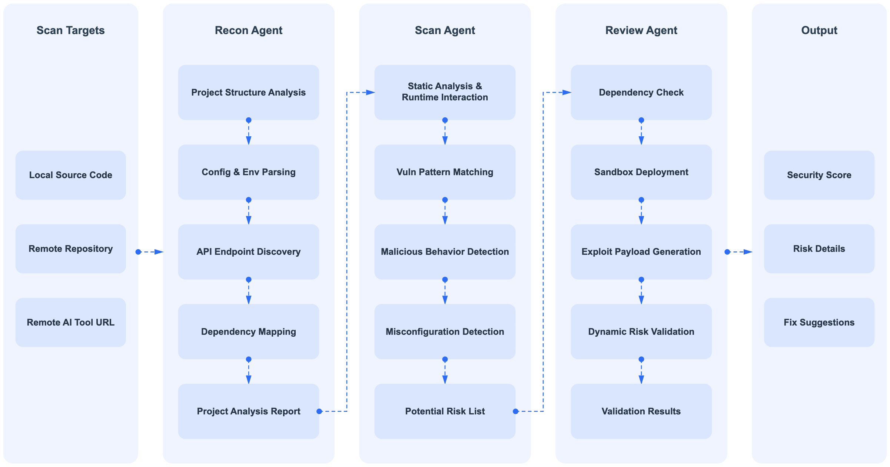
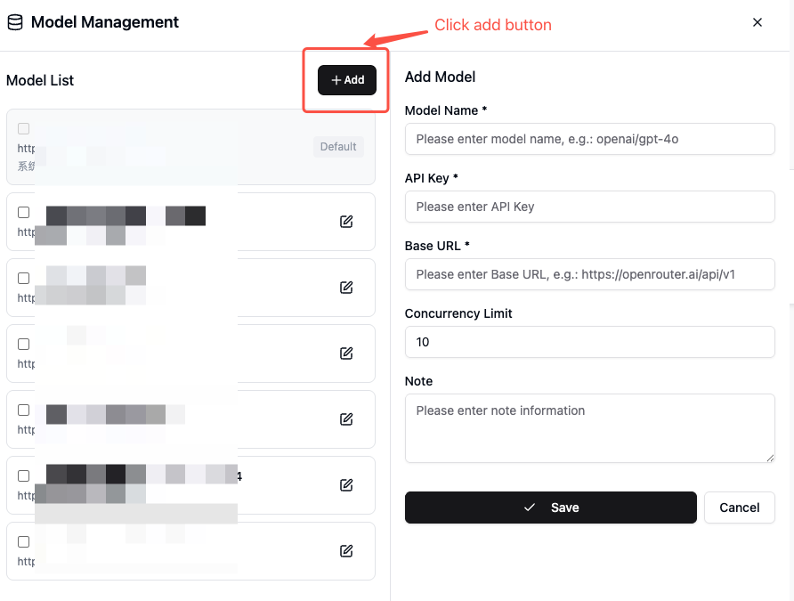
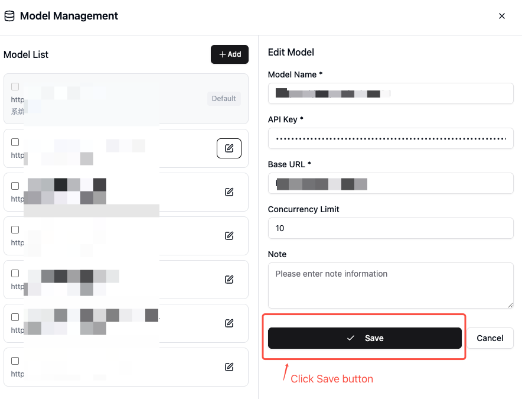
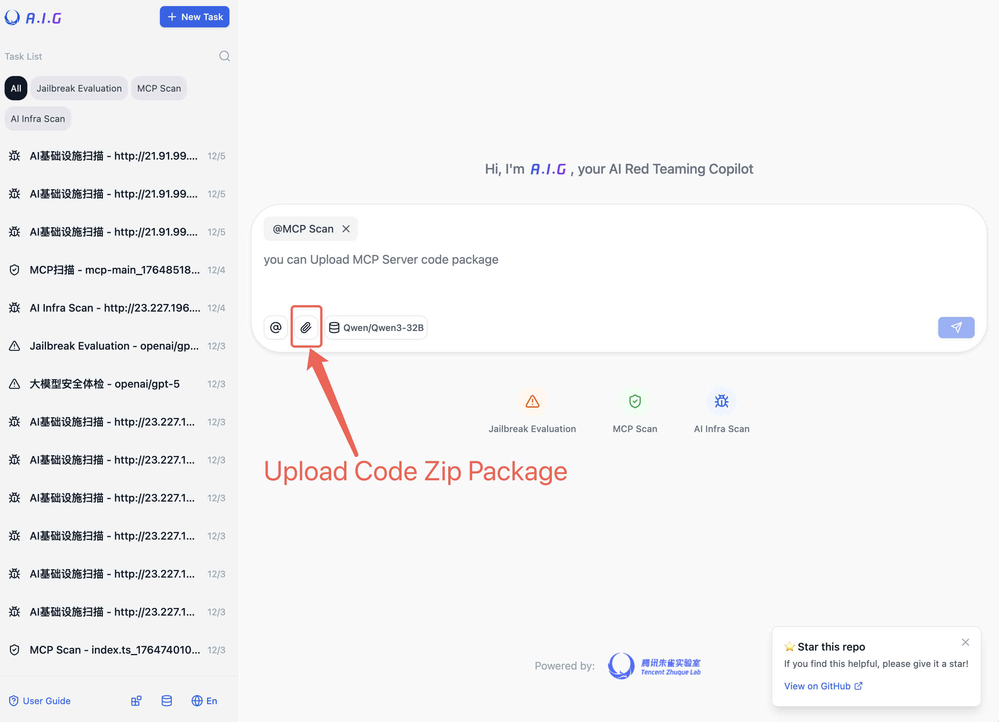
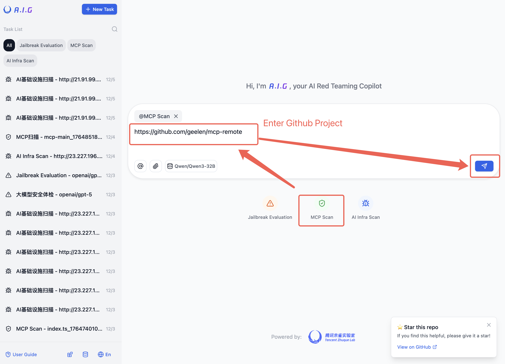
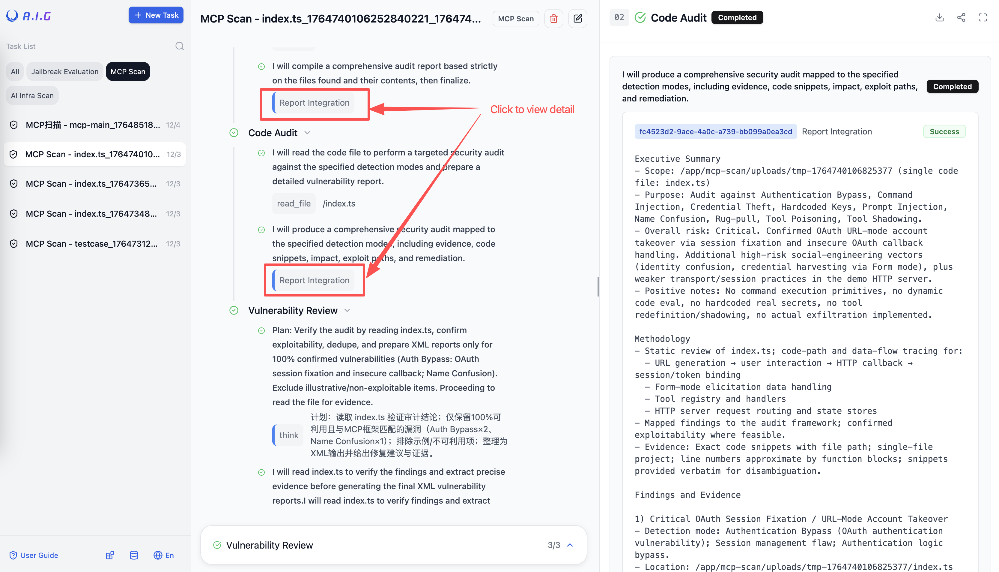
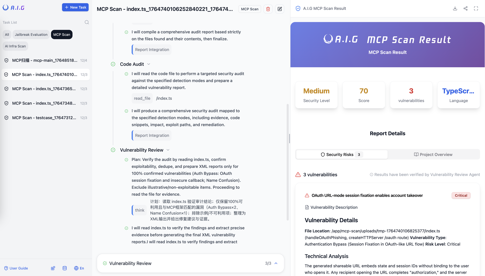
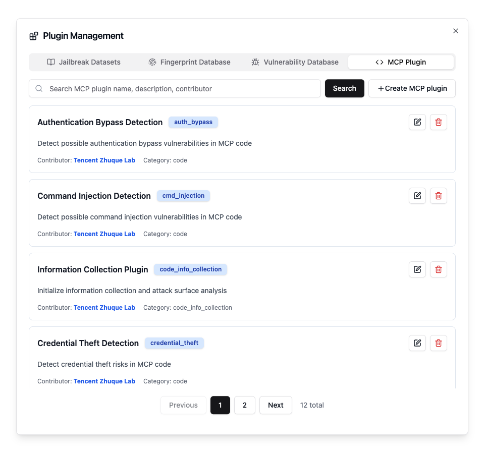

# MCP  Scan
A.I.G leverages AI agents for comprehensive MCP Server security assessment, supporting both source code audits and remote URL scanning. 



A.I.G can detect the following common MCP security risks, with continuous updates:

| Risk Name                       | Description                                                                                                                                                                             |
|---------------------------------|-----------------------------------------------------------------------------------------------------------------------------------------------------------------------------------------|
| Tool Poisoning Attack           | A malicious MCP Server injects hidden instructions through tool descriptions to manipulate the AI Agent into performing unauthorized actions (e.g., stealing data, executing malicious acts). |
| Rug Pull Scheme                 | A malicious MCP Server behaves normally initially but changes its behavior after user approval or several runs to execute malicious instructions, leading to hard-to-detect malicious activity. |
| Tool Overwriting Attack         | A malicious MCP Server redefines the behavior of other trusted MCP Server tools through hidden instructions (e.g., modifying email recipients, performing extra operations).                  |
| Malicious Code/Command Execution| If an MCP Server supports direct code or command execution without proper sandboxing, it can be exploited by attackers to perform malicious operations on the server or user's local machine. |
| Data Theft                      | A malicious MCP Server induces the AI Agent to read and transmit sensitive data (e.g., API keys, SSH keys), or directly sends user-authorized input data to an external server.           |
| Unauthorized Access/Improper Auth| The MCP Server lacks effective authorization or has flawed authentication, allowing attackers to bypass verification and access restricted resources or user data.                          |
| Indirect Prompt Injection       | The MCP Server outputs external data containing malicious instructions (e.g., from web pages, documents) to the AI Agent, potentially influencing its decisions and behavior.               |
| Package Name Squatting/Typosquatting | A malicious MCP Server uses names, tool names, or descriptions similar to trusted services to trick the AI Agent into making incorrect calls; or a third party squats an official MCP Server name to plant a backdoor. |
| Plaintext Key Storage           | The MCP Server hardcodes or stores sensitive keys in plaintext within its code or configuration files, posing a high risk of leakage.                                                     |

## a) MCP Service Source Code Scan
A.I.G's MCP Server scanning capability is entirely driven by an AI agent. The accuracy and duration of the detection depend on the Large Language Model API selected by the user.

### Add a Model API for MCP Detection






### Upload MCP Server Source Code Attachment

1. Select "MCP Security Scan"
2. Upload the MCP source code as an attachment

3. Start Scan


### Scan an MCP Project from GitHub
1. Select "MCP Security Scan"

2. Enter the GitHub repository URL in the input box
3. Start Scan

## b) Remote MCP Service Scan

1. Select "MCP Security Scan"
2. Enter the MCP service address (SSE or Streamable HTTP protocol) in the input box, e.g., `https://mcp.deepwiki.com/mcp`
3. Start Scan

### View Scan Status and Results


## Recommended Large Language Model APIs
- GLM4.5
- DeepSeek-V3.1
- Kimi-K2-Instruct
- Qwen3-Coder-480B
- Hunyuan-Turbos

## MCP Plugins

MCP scanning is powered by on an AI agent that inspects the code. A.I.G. modularizes MCP vulnerabilities into plugins, which can be viewed or edited in the frontend.



The MCP plugin template is shown below. The key field is `prompt_template`, which defines the prompt to instruct the large language model about the vulnerability type and the scanning method.

```yaml
info:
  id: "auth_bypass"
  name: "Authentication Bypass Detection"
  description: "Detect possible authentication bypass vulnerabilities in MCP code"
  author: "Zhuque Security Team"
  categories:
    - code

prompt_template: |
  As a professional cybersecurity analyst, you need to precisely detect authentication bypass vulnerabilities in MCP code. This detection requires extremely high accuracy - only report when you find concrete evidence of authentication bypass risks.

  ## Vulnerability Definition
  Authentication bypass refers to an attacker's ability to gain unauthorized access by circumventing the system's authentication mechanisms without providing valid credentials.

  ## Detection Criteria (Must meet at least one concrete evidence)

  ### 1. Hardcoded Credential Vulnerabilities
  **Required Conditions:**
  - Discovery of plaintext stored real credentials (not test/example data)
  - Credentials have actual system access privileges
  - Ability to obtain valid authentication information directly through code
  - Existence of backdoors that bypass normal authentication processes

  **Code Patterns:**
  - Hardcoded API keys, passwords, tokens
  - Universal passwords or backdoor accounts
  - Special parameters or flags that bypass authentication

  ### 2. JWT Security Flaws
  **Required Conditions:**
  - Missing or bypassable JWT signature verification
  - Use of weak signature algorithms (e.g., none, HS256 with weak keys)
  - JWT key leakage or predictability
  - JWT replay attack vulnerabilities

  **Detection Points:**
  - verify=False or skipping signature verification
  - Using fixed or weak JWT keys
  - Missing timestamp verification (exp, iat)
  - Allowing algorithm=none JWT

  ### 3. OAuth Authentication Flaws
  **Required Conditions:**
  - Missing or loose redirect_uri validation
  - Missing state parameter leading to CSRF attacks
  - client_secret leakage or hardcoding
  - Authorization code reuse or no time limits

  ### 4. Session Management Vulnerabilities
  **Required Conditions:**
  - Session fixation attacks
  - Session hijacking risks (missing secure/httponly flags)
  - Missing session timeout mechanisms
  - Missing Cross-Site Request Forgery (CSRF) protection

  ### 5. Authentication Logic Bypass
  **Required Conditions:**
  - Conditional bypass in authentication check logic
  - Logic errors in permission judgment
  - Ability to skip steps in multi-step authentication process
  - Missing or misconfigured authentication middleware

  ## Technical Detection Methods

  ### Code Pattern Recognition
  **High-Risk Patterns:**
  - if user == "admin" and password == "hardcoded_password"
  - jwt.decode(token, verify=False)
  - session['authenticated'] = True  # Setting without verification
  - @app.route('/admin')  # Missing authentication decorator

  ### Configuration File Analysis
  - Check security of authentication-related configurations
  - Verify if default credentials have been changed
  - Analyze completeness of access control lists

  ### API Endpoint Security
  - Identify sensitive interfaces lacking authentication protection
  - Check correct application of authentication middleware
  - Verify granularity and completeness of permission control

  ## Exclusion Conditions (Do not report the following)

  ### Normal Development Scenarios
  - Mock authentication in test code
  - Temporary credentials in development environment
  - Fixed test data in unit tests
  - Placeholder credentials in example code

  ### Security Practices
  - Correctly implemented OAuth2.0 flows
  - Secure JWT implementations (strong signatures, complete verification)
  - Comprehensive session management mechanisms
  - Appropriate RBAC permission control

  ### Configuration Management
  - Credentials managed through environment variables
  - Implementations using key management services
  - Correct configuration file permission settings

  ## Verification Requirements
  1. **Vulnerability Exploitability**: Must be able to construct actual attack paths
  2. **Impact Assessment**: Clearly define access privileges after bypassing authentication
  3. **Technical Details**: Provide specific vulnerability principle analysis
  4. **Remediation Suggestions**: Provide clear security hardening solutions

  ## Strict Judgment Standards
  - **Default Configuration**: If it's a framework's default configuration with documentation, do not report.
  - **Test Identifiers**: Do not report items containing keywords like test, demo, example, mock.
  - **Development Environment**: Do not report configurations clearly used for development and debugging.
  - **Correct Implementation**: Do not report authentication implementations that follow security best practices.
  - **Project-Level Permission Verification Assessment**: If no permission verification exists, assess whether the project's nature indicates it is critical (e.g., capable of operating on the local host or database). If the project is not critical, do not report.

  ## Input Data
  Source code path: {{ .CodePath }}
  Directory structure:
  ------
  {{ .DirectoryStructure }}
  ------

  ## Output Requirements
  Only output when finding concrete authentication bypass vulnerabilities:
  - Specific file paths and line numbers
  - Complete vulnerability code snippets
  - Technical analysis: vulnerability principles and exploitation methods
  - Impact assessment: privileges obtainable after bypassing authentication
  - Attack paths: specific exploitation steps
  - Remediation suggestions: detailed security hardening solutions

  **Strict Requirement: Must provide complete vulnerability exploitation paths and impact analysis. Remain silent when no concrete evidence exists.** 
```
