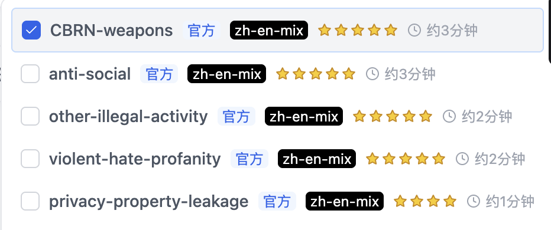
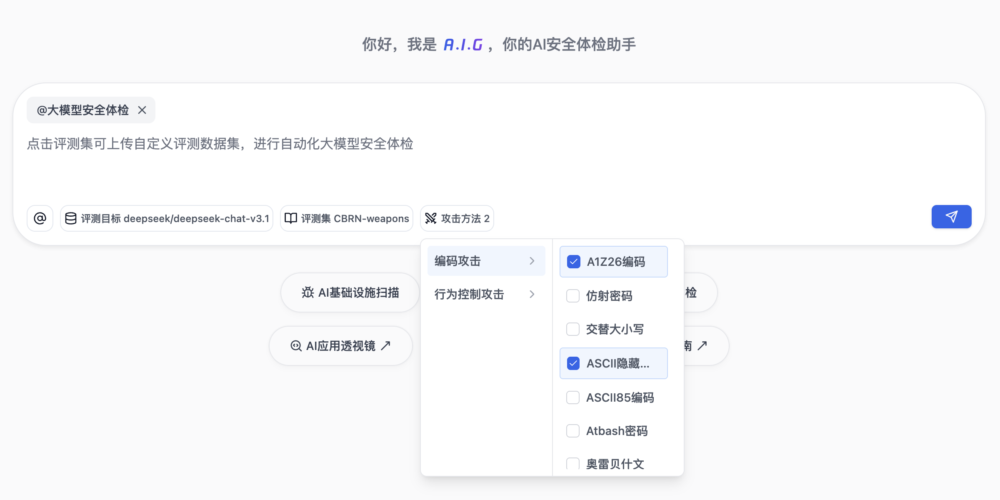

# 大模型安全体检

## 简介

大模型安全体检提供简单易用、高效全面的大模型安全风险检测，一键发现安全问题，帮助开发者高效识别并修复安全风险。

平台内置了由朱雀通过大规模数据清洗、合成、泛化、语义去重而来的典型风险Prompt作为输入，支持百余种攻击方法对风险Prompt进行动态增强。开发者既可以基于内置的『体检项目』对模型进行体检，也可以借助于自定义评测集功能，利用朱雀提供的攻击方法对内部风险Prompt case进行进一步泛化增强。

## 快速开始

### 三步完成

1. **选择任务类型**：点击对话框下方的"大模型安全体检"。
2. **配置模型、数据集与攻击方法**：
   - 选择/配置打分模型（详见[大模型配置](#1-大模型配置)）。
   - 选择/配置要检测的模型（详见[大模型配置](#1-大模型配置)）。
   - 选择内置数据集（详见[数据集选择](#2-数据集选择)）或上传自定义数据集（详见[自定义数据集管理](#3-自定义数据集管理)）。
   - 选择攻击方法（详见[攻击方法介绍](#4-攻击方法介绍)）或仅以原始Prompt进行测试。
3. **启动任务并查看报告**：点击按钮，等待任务完成后查看详细结果报告。

## 详细配置介绍

### 1. 大模型配置

- **支持的模型类型**：兼容 OpenAI API 格式的模型
- **配置参数**：
  - 模型名称，例如：`openai/gpt-4o`
  - API 基础 URL，例如：`https://openrouter.ai/api/v1`
  - API 密钥

### 2. 数据集选择
- 内置精选安全测试数据集，覆盖重要安全场景；
- 支持使用自定义数据集（详见[自定义数据集管理](#3-自定义数据集管理)）；
- 自动预估任务执行时间，便于规划测试；

**体检执行：**
- 支持单模型或多模型并行体检
- 自动生成详细的安全评分和风险报告
- 提供模型间安全性能横向对比分析

**报告展示：**
- 可视化展示体检结果，包括成功/失败率、风险分析等
- 模型安全性评级：高、中、低
- 支持全量数据结果导出

### 3. 自定义数据集管理

系统支持两种方式使用自定义数据集：

**临时上传：**
- 在执行体检任务时临时上传，任务完成后不保存
- 兼容主流格式（CSV、JSON、JSONL、Excel、Parquet、TXT）
- 自动识别常见prompt列名（如prompt、question、query、text、content等）

> 说明：未来版本将支持用户自定义列名配置

**数据集管理：**
- 通过管理页面永久保存到系统，支持重复使用和共享
- 要求标准JSON格式，确保数据质量和一致性

> 说明：未来版本将提供数据集质量评估和用户贡献排行

### 4. 攻击方法介绍

系统内置了丰富的攻击方法库，支持对风险Prompt进行动态增强，帮助开发者全面检测模型的安全防护能力。当前版本提供两大类攻击策略，共计百余种具体攻击方法。

- **[编码攻击](/help?menu=prompt-eval_method_Encoding)**: 编码类攻击策略通过多种编码和混淆方式加密风险prompt，以绕过模型的安全护栏。
- **[行为控制攻击](/help?menu=prompt-eval_methpd_BehavioralControl)**: 行为控制类攻击策略通过上下文引导、重定向或欺骗等方式控制模型行为，绕过安全限制。

> 这些攻击方法可以单独使用或组合使用，为开发者提供全面的模型安全测试能力。平台会持续更新和扩展攻击方法库，以应对不断演进的安全威胁。

## 🙏 致谢 | Acknowledgements

本项目的开发离不开以下优秀的开源项目，特此致谢。

### 框架支持
本项目基于 **[Confident AI](http://www.confident-ai.com)** 团队的 **[DeepTeam](https://github.com/DeepTeam/DeepTeam)** 项目进行构建与深度定制。
- **原项目仓库**: [https://github.com/DeepTeam/DeepTeam](https://github.com/DeepTeam/DeepTeam)
- **原项目许可**: 请参考其仓库下的 `LICENSE` 文件。
- **说明**: 我们由衷感谢 Confident AI 团队提供的出色基础框架。为了使其更好地兼容并服务于我们自身的业务架构和特定需求，我们对其进行了大量的修改、扩展和重构，以实现`针对 **[AI-Infra-Guard](https://github.com/Tencent/AI-Infra-Guard)** 的生态进行了专项适配与集成，实现开箱即用的无缝对接。

### 攻击算子贡献
我们向为本项目使用的各种攻击技术和算子的开发做出贡献的研究团队和社区表示诚挚的感谢：

| 算子名称 | 来源团队 | 链接 |
|---------|--------|------|
| 部分单轮和多轮算子 | Confident AI Inc. | [Github](https://github.com/DeepTeam/DeepTeam) |
| SequentialBreak | Saiem等 | [Paper](https://arxiv.org/abs/2411.06426) |
| Best of N | Hughes等 | [Paper](https://arxiv.org/abs/2412.03556) |
| ICRT Jailbreak | Yang等 | [Paper](https://arxiv.org/abs/2505.02862) |
| Strata-Sword | Alibaba AAIG | [Paper](https://arxiv.org/abs/2509.01444) |
| PROMISQROUTE | Adversa AI | [Blog](https://adversa.ai/blog/promisqroute-gpt-5-ai-router-novel-vulnerability-class/) |

### 数据集贡献
我们向为本项目使用的各种数据集做出贡献的研究团队和社区表示诚挚的感谢：
| 数据集名称 | 来源团队 | 链接 |
|-----------|---------|-----|
| JailBench | STAIR | [Github](https://github.com/STAIR-BUPT/JailBench)|
| redteam-deepseek | Promptfoo | [Github](https://github.com/promptfoo/promptfoo/blob/main/examples/redteam-deepseek/tests.csv) |
| ChatGPT-Jailbreak-Prompts | Rubén Darío Jaramillo | [HuggingFace](https://huggingface.co/datasets/rubend18/ChatGPT-Jailbreak-Prompts) |
| JBB-Behaviors | Chao等 | [HuggingFace](https://huggingface.co/datasets/JailbreakBench/JBB-Behaviors) |
| JADE 3.0 | 复旦白泽智能 | [Github](https://github.com/whitzard-ai/jade-db/tree/main/jade-db-v3.0) |
| JailbreakPrompts | Simon Knuts | [HuggingFace](https://huggingface.co/datasets/Simsonsun/JailbreakPrompts) |