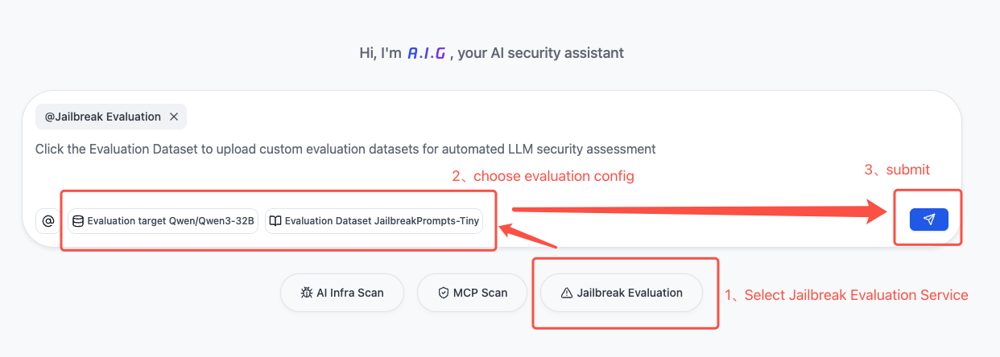

# Jailbreak Evaluation

## Introduction

Jailbreak Evaluation provides a simple, efficient, and comprehensive way to test the security capabilities of large language models. It allows you to discover Jailbreak issues with one click, helping developers efficiently identify and mitigate Jailbreak risks.

## Quick Start

### Complete in Three Steps

1. **Select Task Type**: Click "Jailbreak Evaluation" below the dialog box.
2. **Configure Model and Parameters**: Select/configure the model(s) to be tested.
   - **Select Jailbreak Dataset**: Choose from built-in datasets or upload a custom dataset (see Custom Dataset Management for details).
3. **Start Task and View Report**: Click the button, wait for the task to be completed , then view the detailed report.

## Main Functional Modules

### 1. Large Language Model Configuration

- **Supported Model Types**: Compatible with models that follow the OpenAI API format.
- **Configuration Parameters**:
  - Model Name, e.g., `openai/gpt-4o`
  - API Base URL, e.g., `https://openrouter.ai/api/v1`
  - API Key

### 2. Jailbreak Evaluation

**Dataset Selection:**
- Built-in, curated Jailbreak datasets covering major security scenarios.
- Supports  custom datasets (see Custom Dataset Management for details).
- Automatic estimation of task execution time for better planning.

**Jailbreak Evaluation Execution:**
- Supports single-model or multi-model at one time.
- Automatically generates detailed security scores and risk reports.
- Provides comparative analysis of security performance between models.

**Report Display:**
- Visual presentation of Jailbreak Evaluation results, including success/failure rates, risk analysis, etc.
- Model security ratings: High, Medium, Low.
- Supports exporting the full set of results data.

### 3. Custom Dataset Management

The system supports two ways to use custom datasets:

**Temporary Upload:**
- Uploaded temporarily for a single health check task; not saved after the task is complete.
- Compatible with major formats (CSV, JSON, JSONL, Excel, Parquet, TXT).
- Automatically recognizes common prompt column names (e.g., prompt, question, query, text, content).

> Note: Future versions will support user-defined column name configurations.

**Dataset Management:**
- Allows permanent storage of the data via the management page for reuse and sharing.
- Requires standard JSON format to ensure data quality and consistency.

> Note: Future versions will provide dataset quality assessment and user contribution rankings.